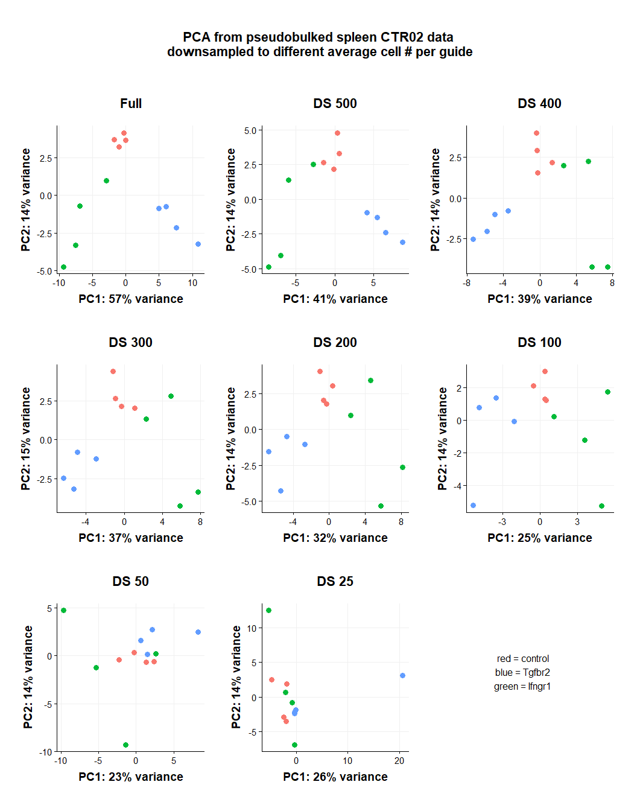

Downsampling analysis cell CTR02
================
Eric Y. Wang
2024-08-02

- [<u>Goal</u>](#goal)
- [<u>Data Import</u>](#data-import)
- [<u>Total Downsample</u>](#total-downsample)
  - [Create Downsampled Data](#create-downsampled-data)
  - [Pseudobulk Analysis (Organ
    Adjusted)](#pseudobulk-analysis-organ-adjusted)
  - [Pseudobulk Analysis (Not Organ
    Adjusted)](#pseudobulk-analysis-not-organ-adjusted)
- [<u>Total Downsample DEG analysis</u>](#total-downsample-deg-analysis)

``` r
source("functions/scRNA_seq_analysis_functions.R")
source("functions/plotting_fxns.R")
theme_set(theme_Publication())
```

## <u>Goal</u>

Here, I will assess the effects of decreasing numbers of cells on
perturb-seq characterization.

## <u>Data Import</u>

``` r
data <- readRDS("C:/Users/Eric/My Drive/Lab/datasets/EYW/CTR02_10x_240516/processing/CTR02_seurat_SCT_CRISPRumi9.rds")
```

Add some metadata columns

``` r
# filter data to only include cells with one guide
data <- subset(data, subset = num_features == 1)
data$feature_gene <- gsub("\\..*","",data$feature_call)
# split hash ID into separate organ and CD62L status
hashSplit <- data@meta.data %>%
  dplyr::select(hash.ID) %>%
  separate(hash.ID,c("organ","CD62L_status"), sep = "-")
data$organ <- hashSplit$organ
data$CD62L_status <- hashSplit$CD62L_status
data$feature_gene <- gsub("NTC|NCC","control",data$feature_gene)
```

## <u>Total Downsample</u>

``` r
p3 <- data@meta.data %>%
  group_by(organ, feature_gene) %>%
  summarise(count = n()) %>%
  ggplot(aes(x = organ, y = count, fill = feature_gene)) +
    geom_bar(stat = "identity") +
    scale_fill_brewer(palette = "Dark2")
```

    ## `summarise()` has grouped output by 'organ'. You can override using the
    ## `.groups` argument.

``` r
p1 <- data@meta.data %>%
  group_by(hash.ID,feature_gene) %>%
  summarise(count = n()) %>%
  ggplot(aes(x = feature_gene, y = count, fill = feature_gene)) +
    geom_bar(stat = "identity") +
    facet_wrap(~hash.ID) +
    scale_fill_brewer(palette = "Dark2")
```

    ## `summarise()` has grouped output by 'hash.ID'. You can override using the
    ## `.groups` argument.

``` r
p2 <- data@meta.data %>%
  group_by(feature_call) %>%
  summarise(count = n()) %>%
  ggplot(aes(x = feature_call, y = count, fill = feature_call)) +
    geom_bar(stat = "identity") +
    NoLegend() +
    theme(axis.text.x = element_text(angle = 45, hjust = 1))

(p1+p3)/p2
```

<!-- -->

For now, I will ignore the differences between CD62L+ and CD62L-. There
are roughly equal numbers of cells between the two

``` r
ncol(data)
```

    ## [1] 16481

``` r
ncol(data)/12
```

    ## [1] 1373.417

In the current dataset, there are **16481 cells total and 12 sgRNA**,
which is an average of **1373** cells per guide. In a real screen I
wouldn’t be able to exactly control the number of cells per guide so I
will just subsample on this data

### Create Downsampled Data

``` r
set.seed(246434)
data700 <- data[, sample(colnames(data), size = 12*700, replace = F)] %>% FindVariableFeatures()
data600 <- data[, sample(colnames(data), size = 12*600, replace = F)] %>% FindVariableFeatures()
data500 <- data[, sample(colnames(data), size = 12*500, replace = F)] %>% FindVariableFeatures()
data400 <- data[, sample(colnames(data), size = 12*400, replace = F)] %>% FindVariableFeatures()
data300 <- data[, sample(colnames(data), size = 12*300, replace = F)] %>% FindVariableFeatures()
data200 <- data[, sample(colnames(data), size = 12*200, replace = F)] %>% FindVariableFeatures()
data100 <- data[, sample(colnames(data), size = 12*100, replace = F)] %>% FindVariableFeatures()
data50 <- data[, sample(colnames(data), size = 12*50, replace = F)] %>% FindVariableFeatures()
data25 <- data[, sample(colnames(data), size = 12*25, replace = F)] %>% FindVariableFeatures()
```

### Pseudobulk Analysis (Organ Adjusted)

``` r
# perform pseudobulk aggregation
pseudodata <- AggregateExpression(data, assays = "SCT", return.seurat = T, group.by = c("organ","CD62L_status","feature_gene","feature_call"))
```

    ## Centering and scaling data matrix

``` r
pseudodata <- pseudodata[!grepl("^Tra[vdj]|^Trb[vdj]",rownames(pseudodata)),]

# perform pseudobulk aggregation
pseudodata8 <- AggregateExpression(data700, assays = "SCT", return.seurat = T, group.by = c("organ","CD62L_status","feature_gene","feature_call"))
```

    ## Centering and scaling data matrix

``` r
pseudodata8 <- pseudodata8[!grepl("^Tra[vdj]|^Trb[vdj]",rownames(pseudodata8)),]

# perform pseudobulk aggregation
pseudodata9 <- AggregateExpression(data600, assays = "SCT", return.seurat = T, group.by = c("organ","CD62L_status","feature_gene","feature_call"))
```

    ## Centering and scaling data matrix

``` r
pseudodata9 <- pseudodata9[!grepl("^Tra[vdj]|^Trb[vdj]",rownames(pseudodata9)),]

# perform pseudobulk aggregation
pseudodata1 <- AggregateExpression(data500, assays = "SCT", return.seurat = T, group.by = c("organ","CD62L_status","feature_gene","feature_call"))
```

    ## Centering and scaling data matrix

``` r
pseudodata1 <- pseudodata1[!grepl("^Tra[vdj]|^Trb[vdj]",rownames(pseudodata1)),]

# perform pseudobulk aggregation
pseudodata2 <- AggregateExpression(data400, assays = "SCT", return.seurat = T, group.by = c("organ","CD62L_status","feature_gene","feature_call"))
```

    ## Centering and scaling data matrix

``` r
pseudodata2 <- pseudodata2[!grepl("^Tra[vdj]|^Trb[vdj]",rownames(pseudodata2)),]

# perform pseudobulk aggregation
pseudodata3 <- AggregateExpression(data300, assays = "SCT", return.seurat = T, group.by = c("organ","CD62L_status","feature_gene","feature_call"))
```

    ## Centering and scaling data matrix

``` r
pseudodata3 <- pseudodata3[!grepl("^Tra[vdj]|^Trb[vdj]",rownames(pseudodata3)),]

# perform pseudobulk aggregation
pseudodata4 <- AggregateExpression(data200, assays = "SCT", return.seurat = T, group.by = c("organ","CD62L_status","feature_gene","feature_call"))
```

    ## Centering and scaling data matrix

``` r
pseudodata4 <- pseudodata4[!grepl("^Tra[vdj]|^Trb[vdj]",rownames(pseudodata4)),]

# perform pseudobulk aggregation
pseudodata5 <- AggregateExpression(data100, assays = "SCT", return.seurat = T, group.by = c("organ","CD62L_status","feature_gene","feature_call"))
```

    ## Centering and scaling data matrix

``` r
pseudodata5 <- pseudodata5[!grepl("^Tra[vdj]|^Trb[vdj]",rownames(pseudodata5)),]

# perform pseudobulk aggregation
pseudodata6 <- AggregateExpression(data50, assays = "SCT", return.seurat = T, group.by = c("organ","CD62L_status","feature_gene","feature_call"))
```

    ## Centering and scaling data matrix

``` r
pseudodata6 <- pseudodata6[!grepl("^Tra[vdj]|^Trb[vdj]",rownames(pseudodata6)),]

# perform pseudobulk aggregation
pseudodata7 <- AggregateExpression(data25, assays = "SCT", return.seurat = T, group.by = c("organ","CD62L_status","feature_gene","feature_call"))
```

    ## Centering and scaling data matrix

``` r
pseudodata7 <- pseudodata7[!grepl("^Tra[vdj]|^Trb[vdj]",rownames(pseudodata7)),]

pdDown <- vector(mode = "list")
pdDown[["full1370"]] <- pseudodata
pdDown[["ds700"]] <- pseudodata8
pdDown[["ds600"]] <- pseudodata9
pdDown[["ds500"]] <- pseudodata1
pdDown[["ds400"]] <- pseudodata2
pdDown[["ds300"]] <- pseudodata3
pdDown[["ds200"]] <- pseudodata4
pdDown[["ds100"]] <- pseudodata5
pdDown[["ds50"]] <- pseudodata6
pdDown[["ds25"]] <- pseudodata7

# find variable features for each subset
pdDown <- lapply(pdDown, function(x) FindVariableFeatures(x, nfeature = 2000))
```

    ## Finding variable features for layer counts

    ## Finding variable features for layer counts
    ## Finding variable features for layer counts
    ## Finding variable features for layer counts
    ## Finding variable features for layer counts
    ## Finding variable features for layer counts
    ## Finding variable features for layer counts
    ## Finding variable features for layer counts
    ## Finding variable features for layer counts
    ## Finding variable features for layer counts

``` r
# create DESeq2 object
ddsDown <- lapply(pdDown, function(x) DESeqDataSetFromMatrix(x@assays$SCT$counts,
                                        colData = x@meta.data,
                                        design = ~ feature_gene + CD62L_status + organ))
```

    ## converting counts to integer mode

    ## Warning in DESeqDataSet(se, design = design, ignoreRank): some variables in
    ## design formula are characters, converting to factors

    ## converting counts to integer mode

    ## Warning in DESeqDataSet(se, design = design, ignoreRank): some variables in
    ## design formula are characters, converting to factors

    ## converting counts to integer mode

    ## Warning in DESeqDataSet(se, design = design, ignoreRank): some variables in
    ## design formula are characters, converting to factors

    ## converting counts to integer mode

    ## Warning in DESeqDataSet(se, design = design, ignoreRank): some variables in
    ## design formula are characters, converting to factors

    ## converting counts to integer mode

    ## Warning in DESeqDataSet(se, design = design, ignoreRank): some variables in
    ## design formula are characters, converting to factors

    ## converting counts to integer mode

    ## Warning in DESeqDataSet(se, design = design, ignoreRank): some variables in
    ## design formula are characters, converting to factors

    ## converting counts to integer mode

    ## Warning in DESeqDataSet(se, design = design, ignoreRank): some variables in
    ## design formula are characters, converting to factors

    ## converting counts to integer mode

    ## Warning in DESeqDataSet(se, design = design, ignoreRank): some variables in
    ## design formula are characters, converting to factors

    ## converting counts to integer mode

    ## Warning in DESeqDataSet(se, design = design, ignoreRank): some variables in
    ## design formula are characters, converting to factors

    ## converting counts to integer mode

    ## Warning in DESeqDataSet(se, design = design, ignoreRank): some variables in
    ## design formula are characters, converting to factors

``` r
# perform VST normalization
# essentially normalizes to library size while stabilizing variance for lowly expressed genes
ddsDownNorm <- lapply(ddsDown, function(x) vst(x))
```

#### Z-score GEX Var Features Correlation

``` r
ZscoreCor <- function(x,y){
  # Extract the normalized matrix from the object and compute pairwise correlation values
  dds_mat <- assay(x)
  dds_mat <- dds_mat[VariableFeatures(y),]
  
  controlMat <- dds_mat[,grepl("NCC|NTC",colnames(dds_mat))]
  controlMean <- apply(controlMat, 1, mean) %>% as.matrix()
  controlSD <- apply(controlMat, 1, sd) %>% as.matrix()
  
  # calculate Zscore for each gene using mean and SD from control groups
  ddsZscore <- data.frame(row.names = rownames(dds_mat))
  for(i in 1:ncol(dds_mat)){
    ddsZscore[,i] <- (dds_mat[,i]-controlMean)/controlSD
  }
  colnames(ddsZscore) <- colnames(dds_mat)
  # remove NAs introduced by Zscoring
  ddsZscore <- na.omit(ddsZscore)
  
  dds_cor <- vector(mode = "list")
  # construct correlation matrix
  dds_cor[["cor"]] <- cor(ddsZscore, use = "complete.obs", method = "pearson") %>%
    as.matrix()
  dds_cor[["p"]] <- cor_pmat(ddsZscore)
  
  return(dds_cor)
}

# calculate correlation and significance
ddsDownCor <- vector(mode = "list")
ddsDownCorP <- vector(mode = "list")
for(i in 1:length(ddsDownNorm)){
  res <- ZscoreCor(ddsDownNorm[[i]],pdDown[[i]])
  ddsDownCor[[names(ddsDownNorm)[i]]] <- res[["cor"]]
  ddsDownCorP[[names(ddsDownNorm)[i]]] <- res[["p"]]
}

plotList <- vector(mode = "list")
for(i in 1:length(ddsDownCor)){
  # Plot heatmap
  plotList[[i]] <- ggcorrplot(ddsDownCor[[i]], p.mat = ddsDownCorP[[i]],
         hc.order = T, hc.method = "single", pch.cex = 6) +
    ggtitle(paste0(names(ddsDownCor)[i]))
}

wrap_plots(plotList,ncol=2, nrow = 5)
```

<!-- -->

#### DEG analysis

##### IFNGR1

``` r
# calculate DEGs for all conditions
ifngr1DEG <- function(x){
  dds <- DESeq(x)
  resLFC <- lfcShrink(dds, contrast = c("feature_gene","Ifngr1","control"), type = "ashr")
  resLFC <- resLFC %>%
    as_tibble(rownames = "genes")
}

# create list of tibbles with DEG results
resIfngr1 <- lapply(ddsDown, function(x) ifngr1DEG(x))
```

    ## estimating size factors

    ## estimating dispersions

    ## gene-wise dispersion estimates

    ## mean-dispersion relationship

    ## final dispersion estimates

    ## fitting model and testing

    ## using 'ashr' for LFC shrinkage. If used in published research, please cite:
    ##     Stephens, M. (2016) False discovery rates: a new deal. Biostatistics, 18:2.
    ##     https://doi.org/10.1093/biostatistics/kxw041

    ## estimating size factors

    ## estimating dispersions

    ## gene-wise dispersion estimates

    ## mean-dispersion relationship

    ## final dispersion estimates

    ## fitting model and testing

    ## using 'ashr' for LFC shrinkage. If used in published research, please cite:
    ##     Stephens, M. (2016) False discovery rates: a new deal. Biostatistics, 18:2.
    ##     https://doi.org/10.1093/biostatistics/kxw041

    ## estimating size factors

    ## estimating dispersions

    ## gene-wise dispersion estimates

    ## mean-dispersion relationship

    ## final dispersion estimates

    ## fitting model and testing

    ## using 'ashr' for LFC shrinkage. If used in published research, please cite:
    ##     Stephens, M. (2016) False discovery rates: a new deal. Biostatistics, 18:2.
    ##     https://doi.org/10.1093/biostatistics/kxw041

    ## estimating size factors

    ## estimating dispersions

    ## gene-wise dispersion estimates

    ## mean-dispersion relationship

    ## final dispersion estimates

    ## fitting model and testing

    ## using 'ashr' for LFC shrinkage. If used in published research, please cite:
    ##     Stephens, M. (2016) False discovery rates: a new deal. Biostatistics, 18:2.
    ##     https://doi.org/10.1093/biostatistics/kxw041

    ## estimating size factors

    ## estimating dispersions

    ## gene-wise dispersion estimates

    ## mean-dispersion relationship

    ## final dispersion estimates

    ## fitting model and testing

    ## using 'ashr' for LFC shrinkage. If used in published research, please cite:
    ##     Stephens, M. (2016) False discovery rates: a new deal. Biostatistics, 18:2.
    ##     https://doi.org/10.1093/biostatistics/kxw041

    ## estimating size factors

    ## estimating dispersions

    ## gene-wise dispersion estimates

    ## mean-dispersion relationship

    ## final dispersion estimates

    ## fitting model and testing

    ## using 'ashr' for LFC shrinkage. If used in published research, please cite:
    ##     Stephens, M. (2016) False discovery rates: a new deal. Biostatistics, 18:2.
    ##     https://doi.org/10.1093/biostatistics/kxw041

    ## estimating size factors

    ## estimating dispersions

    ## gene-wise dispersion estimates

    ## mean-dispersion relationship

    ## final dispersion estimates

    ## fitting model and testing

    ## using 'ashr' for LFC shrinkage. If used in published research, please cite:
    ##     Stephens, M. (2016) False discovery rates: a new deal. Biostatistics, 18:2.
    ##     https://doi.org/10.1093/biostatistics/kxw041

    ## estimating size factors

    ## estimating dispersions

    ## gene-wise dispersion estimates

    ## mean-dispersion relationship

    ## -- note: fitType='parametric', but the dispersion trend was not well captured by the
    ##    function: y = a/x + b, and a local regression fit was automatically substituted.
    ##    specify fitType='local' or 'mean' to avoid this message next time.

    ## final dispersion estimates

    ## fitting model and testing

    ## using 'ashr' for LFC shrinkage. If used in published research, please cite:
    ##     Stephens, M. (2016) False discovery rates: a new deal. Biostatistics, 18:2.
    ##     https://doi.org/10.1093/biostatistics/kxw041

    ## estimating size factors

    ## estimating dispersions

    ## gene-wise dispersion estimates

    ## mean-dispersion relationship

    ## -- note: fitType='parametric', but the dispersion trend was not well captured by the
    ##    function: y = a/x + b, and a local regression fit was automatically substituted.
    ##    specify fitType='local' or 'mean' to avoid this message next time.

    ## final dispersion estimates

    ## fitting model and testing

    ## using 'ashr' for LFC shrinkage. If used in published research, please cite:
    ##     Stephens, M. (2016) False discovery rates: a new deal. Biostatistics, 18:2.
    ##     https://doi.org/10.1093/biostatistics/kxw041

    ## estimating size factors

    ## estimating dispersions

    ## gene-wise dispersion estimates

    ## mean-dispersion relationship

    ## -- note: fitType='parametric', but the dispersion trend was not well captured by the
    ##    function: y = a/x + b, and a local regression fit was automatically substituted.
    ##    specify fitType='local' or 'mean' to avoid this message next time.

    ## final dispersion estimates

    ## fitting model and testing

    ## using 'ashr' for LFC shrinkage. If used in published research, please cite:
    ##     Stephens, M. (2016) False discovery rates: a new deal. Biostatistics, 18:2.
    ##     https://doi.org/10.1093/biostatistics/kxw041

``` r
# Combine the tibbles into a single data frame with an identifier
combinedTib <- bind_rows(
  lapply(seq_along(resIfngr1), function(i) {
    resIfngr1[[i]] %>%
      mutate(tibble_id = names(resIfngr1)[i])
  })
)

# make column for significant DEGs and absolute Log2FC
combinedTib <- combinedTib %>%
  mutate(sig = ifelse(padj < 0.1,TRUE,FALSE),
         log2FC_abs = abs(log2FoldChange),
         tibble_id = factor(tibble_id, c("ds25","ds50","ds100","ds200","ds300","ds400","ds500","ds600","ds700","full1370")))

combinedTib %>%
  group_by(tibble_id) %>%
  drop_na()  %>%
  filter(sig == TRUE) %>%
  group_by(tibble_id) %>%
  summarise(count_DEG = n())
```

    ## # A tibble: 10 × 2
    ##    tibble_id count_DEG
    ##    <fct>         <int>
    ##  1 ds25              1
    ##  2 ds50             48
    ##  3 ds100           105
    ##  4 ds200           231
    ##  5 ds300           291
    ##  6 ds400           308
    ##  7 ds500           351
    ##  8 ds600           439
    ##  9 ds700           464
    ## 10 full1370        843

``` r
p0 <- combinedTib %>%
  group_by(tibble_id) %>%
  drop_na() %>%
  group_by(tibble_id, sig) %>%
  summarise(count_DEG = n()) %>%
  filter(sig == TRUE) %>%
  ggplot(aes(x = tibble_id, y = count_DEG, fill = tibble_id)) +
    geom_bar(stat = "identity") +
    ggtitle("Number of Significant (Padj < 0.1) DEGs") +
    NoLegend()
```

    ## `summarise()` has grouped output by 'tibble_id'. You can override using the
    ## `.groups` argument.

``` r
p1 <- combinedTib %>%
  filter(sig == TRUE) %>%
  ggplot(aes(x = tibble_id, y = log2FC_abs, fill = tibble_id)) +
  geom_boxplot() +
  ggtitle("Absolute Log2FC of Significant DEGs") +
  NoLegend()

p2 <- combinedTib %>%
  filter(sig == TRUE) %>%
  ggplot(aes(x = tibble_id, y = -log10(padj), fill = tibble_id)) +
  geom_boxplot() +
  ggtitle("Pvalue Distribution of Significant DEGs") +
  NoLegend()

p3 <- combinedTib %>%
  filter(sig == TRUE) %>%
  ggplot(aes(x = tibble_id, y = log10(baseMean), fill = tibble_id)) +
  geom_violin() +
  ggtitle("BaseMean Distribution of Significant DEGs") +
  NoLegend()

(p0+p1)/(p2+p3)
```

    ## Warning: Groups with fewer than two datapoints have been dropped.
    ## ℹ Set `drop = FALSE` to consider such groups for position adjustment purposes.

<!-- -->

##### TGFBR1

``` r
# calculate DEGs for all conditions
tgfbr2DEG <- function(x){
  dds <- DESeq(x)
  resLFC <- lfcShrink(dds, contrast = c("feature_gene","Tgfbr2","control"), type = "ashr")
  resLFC <- resLFC %>%
    as_tibble(rownames = "genes")
}

# create list of tibbles with DEG results
resTgfbr2 <- lapply(ddsDown, function(x) tgfbr2DEG(x))
```

    ## estimating size factors

    ## estimating dispersions

    ## gene-wise dispersion estimates

    ## mean-dispersion relationship

    ## final dispersion estimates

    ## fitting model and testing

    ## using 'ashr' for LFC shrinkage. If used in published research, please cite:
    ##     Stephens, M. (2016) False discovery rates: a new deal. Biostatistics, 18:2.
    ##     https://doi.org/10.1093/biostatistics/kxw041

    ## estimating size factors

    ## estimating dispersions

    ## gene-wise dispersion estimates

    ## mean-dispersion relationship

    ## final dispersion estimates

    ## fitting model and testing

    ## using 'ashr' for LFC shrinkage. If used in published research, please cite:
    ##     Stephens, M. (2016) False discovery rates: a new deal. Biostatistics, 18:2.
    ##     https://doi.org/10.1093/biostatistics/kxw041

    ## estimating size factors

    ## estimating dispersions

    ## gene-wise dispersion estimates

    ## mean-dispersion relationship

    ## final dispersion estimates

    ## fitting model and testing

    ## using 'ashr' for LFC shrinkage. If used in published research, please cite:
    ##     Stephens, M. (2016) False discovery rates: a new deal. Biostatistics, 18:2.
    ##     https://doi.org/10.1093/biostatistics/kxw041

    ## estimating size factors

    ## estimating dispersions

    ## gene-wise dispersion estimates

    ## mean-dispersion relationship

    ## final dispersion estimates

    ## fitting model and testing

    ## using 'ashr' for LFC shrinkage. If used in published research, please cite:
    ##     Stephens, M. (2016) False discovery rates: a new deal. Biostatistics, 18:2.
    ##     https://doi.org/10.1093/biostatistics/kxw041

    ## estimating size factors

    ## estimating dispersions

    ## gene-wise dispersion estimates

    ## mean-dispersion relationship

    ## final dispersion estimates

    ## fitting model and testing

    ## using 'ashr' for LFC shrinkage. If used in published research, please cite:
    ##     Stephens, M. (2016) False discovery rates: a new deal. Biostatistics, 18:2.
    ##     https://doi.org/10.1093/biostatistics/kxw041

    ## estimating size factors

    ## estimating dispersions

    ## gene-wise dispersion estimates

    ## mean-dispersion relationship

    ## final dispersion estimates

    ## fitting model and testing

    ## using 'ashr' for LFC shrinkage. If used in published research, please cite:
    ##     Stephens, M. (2016) False discovery rates: a new deal. Biostatistics, 18:2.
    ##     https://doi.org/10.1093/biostatistics/kxw041

    ## estimating size factors

    ## estimating dispersions

    ## gene-wise dispersion estimates

    ## mean-dispersion relationship

    ## final dispersion estimates

    ## fitting model and testing

    ## using 'ashr' for LFC shrinkage. If used in published research, please cite:
    ##     Stephens, M. (2016) False discovery rates: a new deal. Biostatistics, 18:2.
    ##     https://doi.org/10.1093/biostatistics/kxw041

    ## estimating size factors

    ## estimating dispersions

    ## gene-wise dispersion estimates

    ## mean-dispersion relationship

    ## -- note: fitType='parametric', but the dispersion trend was not well captured by the
    ##    function: y = a/x + b, and a local regression fit was automatically substituted.
    ##    specify fitType='local' or 'mean' to avoid this message next time.

    ## final dispersion estimates

    ## fitting model and testing

    ## using 'ashr' for LFC shrinkage. If used in published research, please cite:
    ##     Stephens, M. (2016) False discovery rates: a new deal. Biostatistics, 18:2.
    ##     https://doi.org/10.1093/biostatistics/kxw041

    ## estimating size factors

    ## estimating dispersions

    ## gene-wise dispersion estimates

    ## mean-dispersion relationship

    ## -- note: fitType='parametric', but the dispersion trend was not well captured by the
    ##    function: y = a/x + b, and a local regression fit was automatically substituted.
    ##    specify fitType='local' or 'mean' to avoid this message next time.

    ## final dispersion estimates

    ## fitting model and testing

    ## using 'ashr' for LFC shrinkage. If used in published research, please cite:
    ##     Stephens, M. (2016) False discovery rates: a new deal. Biostatistics, 18:2.
    ##     https://doi.org/10.1093/biostatistics/kxw041

    ## estimating size factors

    ## estimating dispersions

    ## gene-wise dispersion estimates

    ## mean-dispersion relationship

    ## -- note: fitType='parametric', but the dispersion trend was not well captured by the
    ##    function: y = a/x + b, and a local regression fit was automatically substituted.
    ##    specify fitType='local' or 'mean' to avoid this message next time.

    ## final dispersion estimates

    ## fitting model and testing

    ## using 'ashr' for LFC shrinkage. If used in published research, please cite:
    ##     Stephens, M. (2016) False discovery rates: a new deal. Biostatistics, 18:2.
    ##     https://doi.org/10.1093/biostatistics/kxw041

``` r
# Combine the tibbles into a single data frame with an identifier
combinedTib <- bind_rows(
  lapply(seq_along(resTgfbr2), function(i) {
    resTgfbr2[[i]] %>%
      mutate(tibble_id = names(resTgfbr2)[i])
  })
)

# make column for significant DEGs and absolute Log2FC
combinedTib <- combinedTib %>%
  mutate(sig = ifelse(padj < 0.1,TRUE,FALSE),
         log2FC_abs = abs(log2FoldChange),
         tibble_id = factor(tibble_id, c("ds25","ds50","ds100","ds200","ds300","ds400","ds500","ds600","ds700","full1370")))

combinedTib %>%
  group_by(tibble_id) %>%
  drop_na()  %>%
  filter(sig == TRUE) %>%
  group_by(tibble_id) %>%
  summarise(count_DEG = n())
```

    ## # A tibble: 10 × 2
    ##    tibble_id count_DEG
    ##    <fct>         <int>
    ##  1 ds25             14
    ##  2 ds50             28
    ##  3 ds100           105
    ##  4 ds200           201
    ##  5 ds300           357
    ##  6 ds400           457
    ##  7 ds500           590
    ##  8 ds600           753
    ##  9 ds700           937
    ## 10 full1370       1824

``` r
p0 <- combinedTib %>%
  group_by(tibble_id) %>%
  drop_na() %>%
  group_by(tibble_id, sig) %>%
  summarise(count_DEG = n()) %>%
  filter(sig == TRUE) %>%
  ggplot(aes(x = tibble_id, y = count_DEG, fill = tibble_id)) +
    geom_bar(stat = "identity") +
    ggtitle("Number of Significant (Padj < 0.1) DEGs") +
    NoLegend()
```

    ## `summarise()` has grouped output by 'tibble_id'. You can override using the
    ## `.groups` argument.

``` r
p1 <- combinedTib %>%
  filter(sig == TRUE) %>%
  ggplot(aes(x = tibble_id, y = log2FC_abs, fill = tibble_id)) +
  geom_boxplot() +
  ggtitle("Absolute Log2FC of Significant DEGs") +
  NoLegend()

p2 <- combinedTib %>%
  filter(sig == TRUE) %>%
  ggplot(aes(x = tibble_id, y = -log10(padj), fill = tibble_id)) +
  geom_boxplot() +
  ggtitle("Pvalue Distribution of Significant DEGs") +
  NoLegend()

p3 <- combinedTib %>%
  filter(sig == TRUE) %>%
  ggplot(aes(x = tibble_id, y = log10(baseMean), fill = tibble_id)) +
  geom_violin() +
  ggtitle("BaseMean Distribution of Significant DEGs") +
  NoLegend()

(p0+p1)/(p2+p3)
```

<!-- -->

### Pseudobulk Analysis (Not Organ Adjusted)

``` r
# perform pseudobulk aggregation
pseudodata <- AggregateExpression(data, assays = "SCT", return.seurat = T, group.by = c("feature_gene","feature_call"))
```

    ## Centering and scaling data matrix

``` r
pseudodata <- pseudodata[!grepl("^Tra[vdj]|^Trb[vdj]",rownames(pseudodata)),]

# perform pseudobulk aggregation
pseudodata1 <- AggregateExpression(data500, assays = "SCT", return.seurat = T, group.by = c("feature_gene","feature_call"))
```

    ## Centering and scaling data matrix

``` r
pseudodata1 <- pseudodata1[!grepl("^Tra[vdj]|^Trb[vdj]",rownames(pseudodata1)),]

# perform pseudobulk aggregation
pseudodata2 <- AggregateExpression(data400, assays = "SCT", return.seurat = T, group.by = c("feature_gene","feature_call"))
```

    ## Centering and scaling data matrix

``` r
pseudodata2 <- pseudodata2[!grepl("^Tra[vdj]|^Trb[vdj]",rownames(pseudodata2)),]

# perform pseudobulk aggregation
pseudodata3 <- AggregateExpression(data300, assays = "SCT", return.seurat = T, group.by = c("feature_gene","feature_call"))
```

    ## Centering and scaling data matrix

``` r
pseudodata3 <- pseudodata3[!grepl("^Tra[vdj]|^Trb[vdj]",rownames(pseudodata3)),]

# perform pseudobulk aggregation
pseudodata4 <- AggregateExpression(data200, assays = "SCT", return.seurat = T, group.by = c("feature_gene","feature_call"))
```

    ## Centering and scaling data matrix

``` r
pseudodata4 <- pseudodata4[!grepl("^Tra[vdj]|^Trb[vdj]",rownames(pseudodata4)),]

# perform pseudobulk aggregation
pseudodata5 <- AggregateExpression(data100, assays = "SCT", return.seurat = T, group.by = c("feature_gene","feature_call"))
```

    ## Centering and scaling data matrix

``` r
pseudodata5 <- pseudodata5[!grepl("^Tra[vdj]|^Trb[vdj]",rownames(pseudodata5)),]

# perform pseudobulk aggregation
pseudodata6 <- AggregateExpression(data50, assays = "SCT", return.seurat = T, group.by = c("feature_gene","feature_call"))
```

    ## Centering and scaling data matrix

``` r
pseudodata6 <- pseudodata6[!grepl("^Tra[vdj]|^Trb[vdj]",rownames(pseudodata6)),]

# perform pseudobulk aggregation
pseudodata7 <- AggregateExpression(data25, assays = "SCT", return.seurat = T, group.by = c("feature_gene","feature_call"))
```

    ## Centering and scaling data matrix

``` r
pseudodata7 <- pseudodata7[!grepl("^Tra[vdj]|^Trb[vdj]",rownames(pseudodata7)),]

pdDown <- vector(mode = "list")
pdDown[["full1370"]] <- pseudodata
pdDown[["ds500"]] <- pseudodata1
pdDown[["ds400"]] <- pseudodata2
pdDown[["ds300"]] <- pseudodata3
pdDown[["ds200"]] <- pseudodata4
pdDown[["ds100"]] <- pseudodata5
pdDown[["ds50"]] <- pseudodata6
pdDown[["ds25"]] <- pseudodata7

# find variable features for each subset
pdDown <- lapply(pdDown, function(x) FindVariableFeatures(x, nfeature = 2000))
```

    ## Finding variable features for layer counts

    ## Finding variable features for layer counts
    ## Finding variable features for layer counts
    ## Finding variable features for layer counts
    ## Finding variable features for layer counts
    ## Finding variable features for layer counts
    ## Finding variable features for layer counts
    ## Finding variable features for layer counts

``` r
# create DESeq2 object
ddsDown <- lapply(pdDown, function(x) DESeqDataSetFromMatrix(x@assays$SCT$counts,
                                                               colData = x@meta.data,
                                                               design = ~ feature_gene))
```

    ## converting counts to integer mode

    ## Warning in DESeqDataSet(se, design = design, ignoreRank): some variables in
    ## design formula are characters, converting to factors

    ## converting counts to integer mode

    ## Warning in DESeqDataSet(se, design = design, ignoreRank): some variables in
    ## design formula are characters, converting to factors

    ## converting counts to integer mode

    ## Warning in DESeqDataSet(se, design = design, ignoreRank): some variables in
    ## design formula are characters, converting to factors

    ## converting counts to integer mode

    ## Warning in DESeqDataSet(se, design = design, ignoreRank): some variables in
    ## design formula are characters, converting to factors

    ## converting counts to integer mode

    ## Warning in DESeqDataSet(se, design = design, ignoreRank): some variables in
    ## design formula are characters, converting to factors

    ## converting counts to integer mode

    ## Warning in DESeqDataSet(se, design = design, ignoreRank): some variables in
    ## design formula are characters, converting to factors

    ## converting counts to integer mode

    ## Warning in DESeqDataSet(se, design = design, ignoreRank): some variables in
    ## design formula are characters, converting to factors

    ## converting counts to integer mode

    ## Warning in DESeqDataSet(se, design = design, ignoreRank): some variables in
    ## design formula are characters, converting to factors

``` r
# perform VST normalization
# essentially normalizes to library size while stabilizing variance for lowly expressed genes
ddsDownNorm <- lapply(ddsDown, function(x) vst(x))
```

#### PCA Analysis

``` r
p0 <- DESeq2::plotPCA(ddsDownNorm$full, intgroup = "feature_gene", ntop=2000) + theme(aspect.ratio = 1) +
  ggtitle("Full") + NoLegend()
```

    ## using ntop=2000 top features by variance

``` r
p1 <- DESeq2::plotPCA(ddsDownNorm$ds500, intgroup = "feature_gene", ntop=2000) + theme(aspect.ratio = 1) +
  ggtitle("DS 500") + NoLegend()
```

    ## using ntop=2000 top features by variance

``` r
p2 <- DESeq2::plotPCA(ddsDownNorm$ds400, intgroup = "feature_gene", ntop=2000) + theme(aspect.ratio = 1) +
  ggtitle("DS 400") + NoLegend()
```

    ## using ntop=2000 top features by variance

``` r
p3 <- DESeq2::plotPCA(ddsDownNorm$ds300, intgroup = "feature_gene", ntop=2000) + theme(aspect.ratio = 1) +
  ggtitle("DS 300") + NoLegend()
```

    ## using ntop=2000 top features by variance

``` r
p4 <- DESeq2::plotPCA(ddsDownNorm$ds200, intgroup = "feature_gene", ntop=2000) + theme(aspect.ratio = 1) +
  ggtitle("DS 200") + NoLegend()
```

    ## using ntop=2000 top features by variance

``` r
p5 <- DESeq2::plotPCA(ddsDownNorm$ds100, intgroup = "feature_gene", ntop=2000) + theme(aspect.ratio = 1) +
  ggtitle("DS 100") + NoLegend()
```

    ## using ntop=2000 top features by variance

``` r
p6 <- DESeq2::plotPCA(ddsDownNorm$ds50, intgroup = "feature_gene", ntop=2000) + theme(aspect.ratio = 1) +
  ggtitle("DS 50") + NoLegend()
```

    ## using ntop=2000 top features by variance

``` r
p7 <- DESeq2::plotPCA(ddsDownNorm$ds25, intgroup = "feature_gene", ntop=2000) + theme(aspect.ratio = 1) +
  ggtitle("DS 25") + NoLegend()
```

    ## using ntop=2000 top features by variance

``` r
p0+p1+p2+p3+p4+p5+p6+p7+grid::textGrob("red = control\nblue = Tgfbr2\ngreen = Ifngr1")+plot_layout(ncol = 3)+plot_annotation("PCA from pseudobulked spleen CTR02 data\n downsampled to different average cell # per guide")
```

<!-- -->

``` r
ggsave("analysis_outs/downsample_pseudobulk_PCA.pdf")
```

    ## Saving 11 x 14 in image

#### Z-score GEX Var Features Correlation

``` r
ZscoreCor <- function(x,y){
  # Extract the normalized matrix from the object and compute pairwise correlation values
  dds_mat <- assay(x)
  dds_mat <- dds_mat[VariableFeatures(y),]
  
  controlMat <- dds_mat[,grepl("NCC|NTC",colnames(dds_mat))]
  controlMean <- apply(controlMat, 1, mean) %>% as.matrix()
  controlSD <- apply(controlMat, 1, sd) %>% as.matrix()
  
  # calculate Zscore for each gene using mean and SD from control groups
  ddsZscore <- data.frame(row.names = rownames(dds_mat))
  for(i in 1:ncol(dds_mat)){
    ddsZscore[,i] <- (dds_mat[,i]-controlMean)/controlSD
  }
  colnames(ddsZscore) <- colnames(dds_mat)
  # remove NAs introduced by Zscoring
  ddsZscore <- na.omit(ddsZscore)
  
  dds_cor <- vector(mode = "list")
  # construct correlation matrix
  dds_cor[["cor"]] <- cor(ddsZscore, use = "complete.obs", method = "pearson") %>%
    as.matrix()
  dds_cor[["p"]] <- cor_pmat(ddsZscore)
  
  return(dds_cor)
}

# calculate correlation and significance
ddsDownCor <- vector(mode = "list")
ddsDownCorP <- vector(mode = "list")
for(i in 1:length(ddsDownNorm)){
  res <- ZscoreCor(ddsDownNorm[[i]],pdDown[[i]])
  ddsDownCor[[names(ddsDownNorm)[i]]] <- res[["cor"]]
  ddsDownCorP[[names(ddsDownNorm)[i]]] <- res[["p"]]
}

plotList <- vector(mode = "list")
for(i in 1:length(ddsDownCor)){
  # Plot heatmap
  plotList[[i]] <- ggcorrplot(ddsDownCor[[i]], p.mat = ddsDownCorP[[i]],
         hc.order = T, hc.method = "single", pch.cex = 10) +
    ggtitle(paste0(names(ddsDownCor)[i]))
}

wrap_plots(plotList,3,3)
```

<!-- -->

``` r
ggsave("analysis_outs/downsample_pseudobulk_zscoreCor.pdf")
```

    ## Saving 20 x 18 in image

#### DEG analysis

##### IFNGR1

``` r
# calculate DEGs for all conditions
ifngr1DEG <- function(x){
  dds <- DESeq(x)
  resLFC <- lfcShrink(dds, contrast = c("feature_gene","Ifngr1","control"), type = "ashr")
  resLFC <- resLFC %>%
    as_tibble(rownames = "genes")
}

# create list of tibbles with DEG results
resIfngr1 <- lapply(ddsDown, function(x) ifngr1DEG(x))
```

    ## estimating size factors

    ## estimating dispersions

    ## gene-wise dispersion estimates

    ## mean-dispersion relationship

    ## final dispersion estimates

    ## fitting model and testing

    ## using 'ashr' for LFC shrinkage. If used in published research, please cite:
    ##     Stephens, M. (2016) False discovery rates: a new deal. Biostatistics, 18:2.
    ##     https://doi.org/10.1093/biostatistics/kxw041

    ## estimating size factors

    ## estimating dispersions

    ## gene-wise dispersion estimates

    ## mean-dispersion relationship

    ## final dispersion estimates

    ## fitting model and testing

    ## using 'ashr' for LFC shrinkage. If used in published research, please cite:
    ##     Stephens, M. (2016) False discovery rates: a new deal. Biostatistics, 18:2.
    ##     https://doi.org/10.1093/biostatistics/kxw041

    ## estimating size factors

    ## estimating dispersions

    ## gene-wise dispersion estimates

    ## mean-dispersion relationship

    ## final dispersion estimates

    ## fitting model and testing

    ## using 'ashr' for LFC shrinkage. If used in published research, please cite:
    ##     Stephens, M. (2016) False discovery rates: a new deal. Biostatistics, 18:2.
    ##     https://doi.org/10.1093/biostatistics/kxw041

    ## estimating size factors

    ## estimating dispersions

    ## gene-wise dispersion estimates

    ## mean-dispersion relationship

    ## final dispersion estimates

    ## fitting model and testing

    ## using 'ashr' for LFC shrinkage. If used in published research, please cite:
    ##     Stephens, M. (2016) False discovery rates: a new deal. Biostatistics, 18:2.
    ##     https://doi.org/10.1093/biostatistics/kxw041

    ## estimating size factors

    ## estimating dispersions

    ## gene-wise dispersion estimates

    ## mean-dispersion relationship

    ## final dispersion estimates

    ## fitting model and testing

    ## using 'ashr' for LFC shrinkage. If used in published research, please cite:
    ##     Stephens, M. (2016) False discovery rates: a new deal. Biostatistics, 18:2.
    ##     https://doi.org/10.1093/biostatistics/kxw041

    ## estimating size factors

    ## estimating dispersions

    ## gene-wise dispersion estimates

    ## mean-dispersion relationship

    ## final dispersion estimates

    ## fitting model and testing

    ## using 'ashr' for LFC shrinkage. If used in published research, please cite:
    ##     Stephens, M. (2016) False discovery rates: a new deal. Biostatistics, 18:2.
    ##     https://doi.org/10.1093/biostatistics/kxw041

    ## estimating size factors

    ## estimating dispersions

    ## gene-wise dispersion estimates

    ## mean-dispersion relationship

    ## final dispersion estimates

    ## fitting model and testing

    ## using 'ashr' for LFC shrinkage. If used in published research, please cite:
    ##     Stephens, M. (2016) False discovery rates: a new deal. Biostatistics, 18:2.
    ##     https://doi.org/10.1093/biostatistics/kxw041

    ## estimating size factors

    ## estimating dispersions

    ## gene-wise dispersion estimates

    ## mean-dispersion relationship

    ## final dispersion estimates

    ## fitting model and testing

    ## using 'ashr' for LFC shrinkage. If used in published research, please cite:
    ##     Stephens, M. (2016) False discovery rates: a new deal. Biostatistics, 18:2.
    ##     https://doi.org/10.1093/biostatistics/kxw041

``` r
# Combine the tibbles into a single data frame with an identifier
combinedTib <- bind_rows(
  lapply(seq_along(resIfngr1), function(i) {
    resIfngr1[[i]] %>%
      mutate(tibble_id = names(resIfngr1)[i])
  })
)

# make column for significant DEGs and absolute Log2FC
combinedTib <- combinedTib %>%
  mutate(sig = ifelse(padj < 0.1,TRUE,FALSE),
         log2FC_abs = abs(log2FoldChange),
         tibble_id = factor(tibble_id, c("ds25","ds50","ds100","ds200","ds300","ds400","ds500","full1370")))

combinedTib %>%
  group_by(tibble_id) %>%
  drop_na() %>%
  mutate(mean_log2FC = mean(log2FC_abs),
         mean_logPadj = median((-log10(padj)))) %>%
  group_by(tibble_id, mean_log2FC,mean_logPadj, sig) %>%
  summarise(count_DEG = n()) %>%
  filter(sig == TRUE)
```

    ## `summarise()` has grouped output by 'tibble_id', 'mean_log2FC', 'mean_logPadj'.
    ## You can override using the `.groups` argument.

    ## # A tibble: 8 × 5
    ## # Groups:   tibble_id, mean_log2FC, mean_logPadj [8]
    ##   tibble_id mean_log2FC mean_logPadj sig   count_DEG
    ##   <fct>           <dbl>        <dbl> <lgl>     <int>
    ## 1 ds25        0.0000516       0      TRUE          1
    ## 2 ds50        0.0218          0.0307 TRUE         27
    ## 3 ds100       0.0308          0.0632 TRUE        102
    ## 4 ds200       0.0313          0.0592 TRUE        165
    ## 5 ds300       0.0296          0.0635 TRUE        224
    ## 6 ds400       0.0215          0.0167 TRUE        178
    ## 7 ds500       0.0215          0.0286 TRUE        202
    ## 8 full1370    0.0243          0.0472 TRUE        514

``` r
p0 <- combinedTib %>%
  group_by(tibble_id) %>%
  drop_na() %>%
  group_by(tibble_id, sig) %>%
  summarise(count_DEG = n()) %>%
  filter(sig == TRUE) %>%
  ggplot(aes(x = tibble_id, y = count_DEG, fill = tibble_id)) +
    geom_bar(stat = "identity") +
    scale_fill_brewer(palette = "Dark2") +
    ggtitle("Number of Significant (Padj < 0.1) DEGs") +
    NoLegend()
```

    ## `summarise()` has grouped output by 'tibble_id'. You can override using the
    ## `.groups` argument.

``` r
p1 <- combinedTib %>%
  filter(sig == TRUE) %>%
  ggplot(aes(x = tibble_id, y = log2FC_abs, fill = tibble_id)) +
  geom_boxplot() +
  scale_fill_brewer(palette = "Dark2") +
  ggtitle("Absolute Log2FC of Significant DEGs") +
  NoLegend()

p2 <- combinedTib %>%
  filter(sig == TRUE) %>%
  ggplot(aes(x = tibble_id, y = -log10(padj), fill = tibble_id)) +
  geom_boxplot() +
  scale_fill_brewer(palette = "Dark2") +
  ggtitle("Pvalue Distribution of Significant DEGs") +
  NoLegend()

p0+p1+p2
```

<!-- -->

##### TGFBR1

``` r
# calculate DEGs for all conditions
tgfbr2DEG <- function(x){
  dds <- DESeq(x)
  resLFC <- lfcShrink(dds, contrast = c("feature_gene","Tgfbr2","control"), type = "ashr")
  resLFC <- resLFC %>%
    as_tibble(rownames = "genes")
}

# create list of tibbles with DEG results
resTgfbr2 <- lapply(ddsDown, function(x) tgfbr2DEG(x))
```

    ## estimating size factors

    ## estimating dispersions

    ## gene-wise dispersion estimates

    ## mean-dispersion relationship

    ## final dispersion estimates

    ## fitting model and testing

    ## using 'ashr' for LFC shrinkage. If used in published research, please cite:
    ##     Stephens, M. (2016) False discovery rates: a new deal. Biostatistics, 18:2.
    ##     https://doi.org/10.1093/biostatistics/kxw041

    ## estimating size factors

    ## estimating dispersions

    ## gene-wise dispersion estimates

    ## mean-dispersion relationship

    ## final dispersion estimates

    ## fitting model and testing

    ## using 'ashr' for LFC shrinkage. If used in published research, please cite:
    ##     Stephens, M. (2016) False discovery rates: a new deal. Biostatistics, 18:2.
    ##     https://doi.org/10.1093/biostatistics/kxw041

    ## estimating size factors

    ## estimating dispersions

    ## gene-wise dispersion estimates

    ## mean-dispersion relationship

    ## final dispersion estimates

    ## fitting model and testing

    ## using 'ashr' for LFC shrinkage. If used in published research, please cite:
    ##     Stephens, M. (2016) False discovery rates: a new deal. Biostatistics, 18:2.
    ##     https://doi.org/10.1093/biostatistics/kxw041

    ## estimating size factors

    ## estimating dispersions

    ## gene-wise dispersion estimates

    ## mean-dispersion relationship

    ## final dispersion estimates

    ## fitting model and testing

    ## using 'ashr' for LFC shrinkage. If used in published research, please cite:
    ##     Stephens, M. (2016) False discovery rates: a new deal. Biostatistics, 18:2.
    ##     https://doi.org/10.1093/biostatistics/kxw041

    ## estimating size factors

    ## estimating dispersions

    ## gene-wise dispersion estimates

    ## mean-dispersion relationship

    ## final dispersion estimates

    ## fitting model and testing

    ## using 'ashr' for LFC shrinkage. If used in published research, please cite:
    ##     Stephens, M. (2016) False discovery rates: a new deal. Biostatistics, 18:2.
    ##     https://doi.org/10.1093/biostatistics/kxw041

    ## estimating size factors

    ## estimating dispersions

    ## gene-wise dispersion estimates

    ## mean-dispersion relationship

    ## final dispersion estimates

    ## fitting model and testing

    ## using 'ashr' for LFC shrinkage. If used in published research, please cite:
    ##     Stephens, M. (2016) False discovery rates: a new deal. Biostatistics, 18:2.
    ##     https://doi.org/10.1093/biostatistics/kxw041

    ## estimating size factors

    ## estimating dispersions

    ## gene-wise dispersion estimates

    ## mean-dispersion relationship

    ## final dispersion estimates

    ## fitting model and testing

    ## using 'ashr' for LFC shrinkage. If used in published research, please cite:
    ##     Stephens, M. (2016) False discovery rates: a new deal. Biostatistics, 18:2.
    ##     https://doi.org/10.1093/biostatistics/kxw041

    ## estimating size factors

    ## estimating dispersions

    ## gene-wise dispersion estimates

    ## mean-dispersion relationship

    ## final dispersion estimates

    ## fitting model and testing

    ## using 'ashr' for LFC shrinkage. If used in published research, please cite:
    ##     Stephens, M. (2016) False discovery rates: a new deal. Biostatistics, 18:2.
    ##     https://doi.org/10.1093/biostatistics/kxw041

``` r
# Combine the tibbles into a single data frame with an identifier
combinedTib <- bind_rows(
  lapply(seq_along(resTgfbr2), function(i) {
    resTgfbr2[[i]] %>%
      mutate(tibble_id = names(resTgfbr2)[i])
  })
)

# make column for significant DEGs and absolute Log2FC
combinedTib <- combinedTib %>%
  mutate(sig = ifelse(padj < 0.1,TRUE,FALSE),
         log2FC_abs = abs(log2FoldChange),
         tibble_id = factor(tibble_id, c("ds25","ds50","ds100","ds200","ds300","ds400","ds500","full1370")))

combinedTib %>%
  group_by(tibble_id) %>%
  drop_na() %>%
  mutate(mean_log2FC = mean(log2FC_abs),
         mean_logPadj = median((-log10(padj)))) %>%
  group_by(tibble_id, mean_log2FC,mean_logPadj, sig) %>%
  summarise(count_DEG = n()) %>%
  filter(sig == TRUE)
```

    ## `summarise()` has grouped output by 'tibble_id', 'mean_log2FC', 'mean_logPadj'.
    ## You can override using the `.groups` argument.

    ## # A tibble: 8 × 5
    ## # Groups:   tibble_id, mean_log2FC, mean_logPadj [8]
    ##   tibble_id mean_log2FC mean_logPadj sig   count_DEG
    ##   <fct>           <dbl>        <dbl> <lgl>     <int>
    ## 1 ds25         0.000125     0.000363 TRUE          9
    ## 2 ds50         0.00203      0        TRUE         19
    ## 3 ds100        0.00903      0.000189 TRUE         71
    ## 4 ds200        0.0129       0.000335 TRUE        131
    ## 5 ds300        0.0178       0.000264 TRUE        198
    ## 6 ds400        0.0209       0.00101  TRUE        280
    ## 7 ds500        0.0246       0.0118   TRUE        361
    ## 8 full1370     0.0477       0.104    TRUE       1201

``` r
p0 <- combinedTib %>%
  group_by(tibble_id) %>%
  drop_na() %>%
  group_by(tibble_id, sig) %>%
  summarise(count_DEG = n()) %>%
  filter(sig == TRUE) %>%
  ggplot(aes(x = tibble_id, y = count_DEG, fill = tibble_id)) +
    geom_bar(stat = "identity") +
    scale_fill_brewer(palette = "Dark2") +
    ggtitle("Number of Significant (Padj < 0.1) DEGs") +
    NoLegend()
```

    ## `summarise()` has grouped output by 'tibble_id'. You can override using the
    ## `.groups` argument.

``` r
p1 <- combinedTib %>%
  filter(sig == TRUE) %>%
  ggplot(aes(x = tibble_id, y = log2FC_abs, fill = tibble_id)) +
  geom_boxplot() +
  scale_fill_brewer(palette = "Dark2") +
  ggtitle("Absolute Log2FC of Significant DEGs") +
  NoLegend()

p2 <- combinedTib %>%
  filter(sig == TRUE) %>%
  ggplot(aes(x = tibble_id, y = -log10(padj), fill = tibble_id)) +
  geom_boxplot() +
  scale_fill_brewer(palette = "Dark2") +
  ggtitle("Pvalue Distribution of Significant DEGs") +
  NoLegend()

p0+p1+p2
```

<!-- -->

## <u>Total Downsample DEG analysis</u>

I want to make sure that my conclusions about DEG identification between
pooled and single organs is still true when things are downsampled. I
will use the downsampled data from both pooled cells and organ specific
cells, where all are downsampled to the same cell number.

``` r
# function to return list of downsampled pseudobulked DESeq objects
# list contains total cells and organ/CD62L subsetted groups
# all groups contain equal numbers of cells
downsamplePD <- function(input, num_cells){
  # perform organ-specific PB aggregation
  dataOrgan <- vector(mode = "list")
  dataOrgan[["all"]] <- input
  dataOrgan[["spleen"]] <- subset(input, subset = organ == "spleen")
  dataOrgan[["mLN"]] <- subset(input, subset = organ == "mLN")
  dataOrgan[["CD62Lpos"]] <- subset(input, subset = CD62L_status == "CD62Lpos")
  dataOrgan[["CD62Lneg"]] <- subset(input, subset = CD62L_status == "CD62Lneg")
  
  # perform downsampling to a given number of cells average for each group
  dataOrgan <- lapply(dataOrgan, function(x) x[,sample(colnames(x), size = 12*num_cells, replace = F)])
  
  pdOrgan <- vector(mode = "list", length = 5)
  names(pdOrgan) <- c("all","spleen","mLN","CD62Lpos","CD62Lneg")
  # pseudobulk and remove TCR genes
  pdOrgan[1] <- lapply(dataOrgan[1], function(x) AggregateExpression(x, assays = "SCT", return.seurat = T, group.by = c("organ","CD62L_status","feature_gene","feature_call")))
  pdOrgan[2:3] <- lapply(dataOrgan[2:3], function(x) AggregateExpression(x, assays = "SCT", return.seurat = T, group.by = c("CD62L_status","feature_gene","feature_call")))
  pdOrgan[4:5] <- lapply(dataOrgan[4:5], function(x) AggregateExpression(x, assays = "SCT", return.seurat = T, group.by = c("organ","feature_gene","feature_call")))
  
  # remove TCR genes
  pdOrgan <- lapply(pdOrgan, function(x) x[!grepl("^Tra[vdj]|^Trb[vdj]",rownames(x)),])
  
  ddsOrgan <- vector(mode = "list", length = 5)
  names(ddsOrgan) <- c("all","spleen","mLN","CD62Lpos","CD62Lneg")
  # create DESeq2 object and adjust for appropriate factors
  ddsOrgan[1] <- lapply(pdOrgan[1], function(x) DESeqDataSetFromMatrix(x@assays$SCT$counts,
                                                  colData = x@meta.data,
                                                   design = ~ feature_gene + organ + CD62L_status))
   ddsOrgan[2:3] <- lapply(pdOrgan[2:3], function(x) DESeqDataSetFromMatrix(x@assays$SCT$counts,
                                                  colData = x@meta.data,
                                                   design = ~ feature_gene + CD62L_status))
   ddsOrgan[4:5] <- lapply(pdOrgan[4:5], function(x) DESeqDataSetFromMatrix(x@assays$SCT$counts,
                                                  colData = x@meta.data,
                                                   design = ~ feature_gene + organ))
  

   
  # run DEseq analysis
  ddsOrgan <- lapply(ddsOrgan, function(x) DESeq(x))
  
  # # add dds with pooled cells from above
  # ddsOrgan[["all"]] <- dds
  
  return(ddsOrgan)
}
```

``` r
set.seed(320925)
dds200 <- downsamplePD(data,200)
```

    ## Centering and scaling data matrix
    ## Centering and scaling data matrix
    ## Centering and scaling data matrix
    ## Centering and scaling data matrix
    ## Centering and scaling data matrix

    ## converting counts to integer mode

    ## Warning in DESeqDataSet(se, design = design, ignoreRank): some variables in
    ## design formula are characters, converting to factors

    ## converting counts to integer mode

    ## Warning in DESeqDataSet(se, design = design, ignoreRank): some variables in
    ## design formula are characters, converting to factors

    ## converting counts to integer mode

    ## Warning in DESeqDataSet(se, design = design, ignoreRank): some variables in
    ## design formula are characters, converting to factors

    ## converting counts to integer mode

    ## Warning in DESeqDataSet(se, design = design, ignoreRank): some variables in
    ## design formula are characters, converting to factors

    ## converting counts to integer mode

    ## Warning in DESeqDataSet(se, design = design, ignoreRank): some variables in
    ## design formula are characters, converting to factors

    ## estimating size factors

    ## estimating dispersions

    ## gene-wise dispersion estimates

    ## mean-dispersion relationship

    ## final dispersion estimates

    ## fitting model and testing

    ## estimating size factors

    ## estimating dispersions

    ## gene-wise dispersion estimates

    ## mean-dispersion relationship

    ## final dispersion estimates

    ## fitting model and testing

    ## estimating size factors

    ## estimating dispersions

    ## gene-wise dispersion estimates

    ## mean-dispersion relationship

    ## final dispersion estimates

    ## fitting model and testing

    ## estimating size factors

    ## estimating dispersions

    ## gene-wise dispersion estimates

    ## mean-dispersion relationship

    ## final dispersion estimates

    ## fitting model and testing

    ## estimating size factors

    ## estimating dispersions

    ## gene-wise dispersion estimates

    ## mean-dispersion relationship

    ## final dispersion estimates

    ## fitting model and testing

``` r
dds300 <- downsamplePD(data,300)
```

    ## Centering and scaling data matrix

    ## Centering and scaling data matrix
    ## Centering and scaling data matrix
    ## Centering and scaling data matrix
    ## Centering and scaling data matrix

    ## converting counts to integer mode

    ## Warning in DESeqDataSet(se, design = design, ignoreRank): some variables in
    ## design formula are characters, converting to factors

    ## converting counts to integer mode

    ## Warning in DESeqDataSet(se, design = design, ignoreRank): some variables in
    ## design formula are characters, converting to factors

    ## converting counts to integer mode

    ## Warning in DESeqDataSet(se, design = design, ignoreRank): some variables in
    ## design formula are characters, converting to factors

    ## converting counts to integer mode

    ## Warning in DESeqDataSet(se, design = design, ignoreRank): some variables in
    ## design formula are characters, converting to factors

    ## converting counts to integer mode

    ## Warning in DESeqDataSet(se, design = design, ignoreRank): some variables in
    ## design formula are characters, converting to factors

    ## estimating size factors

    ## estimating dispersions

    ## gene-wise dispersion estimates

    ## mean-dispersion relationship

    ## final dispersion estimates

    ## fitting model and testing

    ## estimating size factors

    ## estimating dispersions

    ## gene-wise dispersion estimates

    ## mean-dispersion relationship

    ## final dispersion estimates

    ## fitting model and testing

    ## estimating size factors

    ## estimating dispersions

    ## gene-wise dispersion estimates

    ## mean-dispersion relationship

    ## final dispersion estimates

    ## fitting model and testing

    ## estimating size factors

    ## estimating dispersions

    ## gene-wise dispersion estimates

    ## mean-dispersion relationship

    ## final dispersion estimates

    ## fitting model and testing

    ## estimating size factors

    ## estimating dispersions

    ## gene-wise dispersion estimates

    ## mean-dispersion relationship

    ## final dispersion estimates

    ## fitting model and testing

``` r
dds400 <- downsamplePD(data,400)
```

    ## Centering and scaling data matrix

    ## Centering and scaling data matrix
    ## Centering and scaling data matrix
    ## Centering and scaling data matrix
    ## Centering and scaling data matrix

    ## converting counts to integer mode

    ## Warning in DESeqDataSet(se, design = design, ignoreRank): some variables in
    ## design formula are characters, converting to factors

    ## converting counts to integer mode

    ## Warning in DESeqDataSet(se, design = design, ignoreRank): some variables in
    ## design formula are characters, converting to factors

    ## converting counts to integer mode

    ## Warning in DESeqDataSet(se, design = design, ignoreRank): some variables in
    ## design formula are characters, converting to factors

    ## converting counts to integer mode

    ## Warning in DESeqDataSet(se, design = design, ignoreRank): some variables in
    ## design formula are characters, converting to factors

    ## converting counts to integer mode

    ## Warning in DESeqDataSet(se, design = design, ignoreRank): some variables in
    ## design formula are characters, converting to factors

    ## estimating size factors

    ## estimating dispersions

    ## gene-wise dispersion estimates

    ## mean-dispersion relationship

    ## final dispersion estimates

    ## fitting model and testing

    ## estimating size factors

    ## estimating dispersions

    ## gene-wise dispersion estimates

    ## mean-dispersion relationship

    ## final dispersion estimates

    ## fitting model and testing

    ## estimating size factors

    ## estimating dispersions

    ## gene-wise dispersion estimates

    ## mean-dispersion relationship

    ## final dispersion estimates

    ## fitting model and testing

    ## estimating size factors

    ## estimating dispersions

    ## gene-wise dispersion estimates

    ## mean-dispersion relationship

    ## final dispersion estimates

    ## fitting model and testing

    ## estimating size factors

    ## estimating dispersions

    ## gene-wise dispersion estimates

    ## mean-dispersion relationship

    ## final dispersion estimates

    ## fitting model and testing

``` r
dds500 <- downsamplePD(data,500)
```

    ## Centering and scaling data matrix

    ## Centering and scaling data matrix
    ## Centering and scaling data matrix
    ## Centering and scaling data matrix
    ## Centering and scaling data matrix

    ## converting counts to integer mode

    ## Warning in DESeqDataSet(se, design = design, ignoreRank): some variables in
    ## design formula are characters, converting to factors

    ## converting counts to integer mode

    ## Warning in DESeqDataSet(se, design = design, ignoreRank): some variables in
    ## design formula are characters, converting to factors

    ## converting counts to integer mode

    ## Warning in DESeqDataSet(se, design = design, ignoreRank): some variables in
    ## design formula are characters, converting to factors

    ## converting counts to integer mode

    ## Warning in DESeqDataSet(se, design = design, ignoreRank): some variables in
    ## design formula are characters, converting to factors

    ## converting counts to integer mode

    ## Warning in DESeqDataSet(se, design = design, ignoreRank): some variables in
    ## design formula are characters, converting to factors

    ## estimating size factors

    ## estimating dispersions

    ## gene-wise dispersion estimates

    ## mean-dispersion relationship

    ## final dispersion estimates

    ## fitting model and testing

    ## estimating size factors

    ## estimating dispersions

    ## gene-wise dispersion estimates

    ## mean-dispersion relationship

    ## final dispersion estimates

    ## fitting model and testing

    ## estimating size factors

    ## estimating dispersions

    ## gene-wise dispersion estimates

    ## mean-dispersion relationship

    ## final dispersion estimates

    ## fitting model and testing

    ## estimating size factors

    ## estimating dispersions

    ## gene-wise dispersion estimates

    ## mean-dispersion relationship

    ## final dispersion estimates

    ## fitting model and testing

    ## estimating size factors

    ## estimating dispersions

    ## gene-wise dispersion estimates

    ## mean-dispersion relationship

    ## final dispersion estimates

    ## fitting model and testing

``` r
# calculate DEGs for all conditions
ifngr1DEG <- function(x){
  resLFC <- results(x, contrast = c("feature_gene","Ifngr1","control"), alpha = 0.1)
  resLFC <- lfcShrink(x, contrast = c("feature_gene","Ifngr1","control"), res=resLFC, type = "ashr")
  resLFC <- resLFC %>%
    as_tibble(rownames = "genes")
}

# calculate DEGs for all conditions
tgfbr2DEG <- function(x){
  resLFC <- results(x, contrast = c("feature_gene","Tgfbr2","control"), alpha = 0.1)
  resLFC <- lfcShrink(x, contrast = c("feature_gene","Tgfbr2","control"), res=resLFC, type = "ashr")
  resLFC <- resLFC %>%
    as_tibble(rownames = "genes")
}

# wrapper function to plot list of DEGs generated with ifngr1DEG or tgfbr2DEG
plotDEGcomp <- function(input){
  # Combine the tibbles into a single data frame with an identifier
  combinedTib <- bind_rows(
    lapply(seq_along(input), function(i) {
      input[[i]] %>%
        mutate(tibble_id = names(input)[i])
    })
  )
  
  # Separate the first tibble for comparison
  referenceTib <- combinedTib %>% filter(tibble_id == "all")
  comparisonTib <- combinedTib %>% filter(tibble_id != "all")
  
  # Merge the reference tibble with the comparison data
  comparisonTib1 <- comparisonTib %>%
    left_join(referenceTib, by = "genes", suffix = c("", "_ref")) %>%
    mutate(
      significance = case_when(
        padj_ref < 0.1 & padj < 0.1 ~ "both",
        padj_ref < 0.1 ~ "pooled cells specific",
        padj < 0.1 ~ "group specific",
        TRUE ~ "none"
      )) %>%
    filter(significance != "none") %>%
    mutate(significance = factor(significance, c("pooled cells specific","group specific","both"))
    )
  
  
  # Plotting
  ggplot(comparisonTib1, aes(x = log2FoldChange_ref, y = log2FoldChange, color = significance)) +
    geom_point() +
    geom_abline(slope = 1, intercept = 0, linetype = "dashed") +
    facet_wrap(~tibble_id) +
    theme(aspect.ratio = 1) +
    xlim(-3,3) +
    ylim(-3,3) +
    scale_color_brewer(palette = "Dark2") +
    labs(
      x = "log2FC (pooled cells)",
      y = "log2FC (group)"
    )
}
```

``` r
# create list of tibbles with DEG results
resIfngr1 <- lapply(dds200, function(x) ifngr1DEG(x))
```

    ## using 'ashr' for LFC shrinkage. If used in published research, please cite:
    ##     Stephens, M. (2016) False discovery rates: a new deal. Biostatistics, 18:2.
    ##     https://doi.org/10.1093/biostatistics/kxw041
    ## using 'ashr' for LFC shrinkage. If used in published research, please cite:
    ##     Stephens, M. (2016) False discovery rates: a new deal. Biostatistics, 18:2.
    ##     https://doi.org/10.1093/biostatistics/kxw041
    ## using 'ashr' for LFC shrinkage. If used in published research, please cite:
    ##     Stephens, M. (2016) False discovery rates: a new deal. Biostatistics, 18:2.
    ##     https://doi.org/10.1093/biostatistics/kxw041
    ## using 'ashr' for LFC shrinkage. If used in published research, please cite:
    ##     Stephens, M. (2016) False discovery rates: a new deal. Biostatistics, 18:2.
    ##     https://doi.org/10.1093/biostatistics/kxw041
    ## using 'ashr' for LFC shrinkage. If used in published research, please cite:
    ##     Stephens, M. (2016) False discovery rates: a new deal. Biostatistics, 18:2.
    ##     https://doi.org/10.1093/biostatistics/kxw041

``` r
resTgfbr2 <- lapply(dds200, function(x) tgfbr2DEG(x))
```

    ## using 'ashr' for LFC shrinkage. If used in published research, please cite:
    ##     Stephens, M. (2016) False discovery rates: a new deal. Biostatistics, 18:2.
    ##     https://doi.org/10.1093/biostatistics/kxw041
    ## using 'ashr' for LFC shrinkage. If used in published research, please cite:
    ##     Stephens, M. (2016) False discovery rates: a new deal. Biostatistics, 18:2.
    ##     https://doi.org/10.1093/biostatistics/kxw041
    ## using 'ashr' for LFC shrinkage. If used in published research, please cite:
    ##     Stephens, M. (2016) False discovery rates: a new deal. Biostatistics, 18:2.
    ##     https://doi.org/10.1093/biostatistics/kxw041
    ## using 'ashr' for LFC shrinkage. If used in published research, please cite:
    ##     Stephens, M. (2016) False discovery rates: a new deal. Biostatistics, 18:2.
    ##     https://doi.org/10.1093/biostatistics/kxw041
    ## using 'ashr' for LFC shrinkage. If used in published research, please cite:
    ##     Stephens, M. (2016) False discovery rates: a new deal. Biostatistics, 18:2.
    ##     https://doi.org/10.1093/biostatistics/kxw041

``` r
p1 <- plotDEGcomp(resIfngr1) + ggtitle("Comparison of shrunken Log2FC for Ifngr1 KO\n200 cells/sgRNA average")
p2 <- plotDEGcomp(resTgfbr2) + ggtitle("Comparison of shrunken Log2FC for Tgfbr2 KO\n200 cells/sgRNA average")
```

``` r
# create list of tibbles with DEG results
resIfngr1 <- lapply(dds300, function(x) ifngr1DEG(x))
```

    ## using 'ashr' for LFC shrinkage. If used in published research, please cite:
    ##     Stephens, M. (2016) False discovery rates: a new deal. Biostatistics, 18:2.
    ##     https://doi.org/10.1093/biostatistics/kxw041
    ## using 'ashr' for LFC shrinkage. If used in published research, please cite:
    ##     Stephens, M. (2016) False discovery rates: a new deal. Biostatistics, 18:2.
    ##     https://doi.org/10.1093/biostatistics/kxw041
    ## using 'ashr' for LFC shrinkage. If used in published research, please cite:
    ##     Stephens, M. (2016) False discovery rates: a new deal. Biostatistics, 18:2.
    ##     https://doi.org/10.1093/biostatistics/kxw041
    ## using 'ashr' for LFC shrinkage. If used in published research, please cite:
    ##     Stephens, M. (2016) False discovery rates: a new deal. Biostatistics, 18:2.
    ##     https://doi.org/10.1093/biostatistics/kxw041
    ## using 'ashr' for LFC shrinkage. If used in published research, please cite:
    ##     Stephens, M. (2016) False discovery rates: a new deal. Biostatistics, 18:2.
    ##     https://doi.org/10.1093/biostatistics/kxw041

``` r
resTgfbr2 <- lapply(dds300, function(x) tgfbr2DEG(x))
```

    ## using 'ashr' for LFC shrinkage. If used in published research, please cite:
    ##     Stephens, M. (2016) False discovery rates: a new deal. Biostatistics, 18:2.
    ##     https://doi.org/10.1093/biostatistics/kxw041
    ## using 'ashr' for LFC shrinkage. If used in published research, please cite:
    ##     Stephens, M. (2016) False discovery rates: a new deal. Biostatistics, 18:2.
    ##     https://doi.org/10.1093/biostatistics/kxw041
    ## using 'ashr' for LFC shrinkage. If used in published research, please cite:
    ##     Stephens, M. (2016) False discovery rates: a new deal. Biostatistics, 18:2.
    ##     https://doi.org/10.1093/biostatistics/kxw041
    ## using 'ashr' for LFC shrinkage. If used in published research, please cite:
    ##     Stephens, M. (2016) False discovery rates: a new deal. Biostatistics, 18:2.
    ##     https://doi.org/10.1093/biostatistics/kxw041
    ## using 'ashr' for LFC shrinkage. If used in published research, please cite:
    ##     Stephens, M. (2016) False discovery rates: a new deal. Biostatistics, 18:2.
    ##     https://doi.org/10.1093/biostatistics/kxw041

``` r
p3 <- plotDEGcomp(resIfngr1) + ggtitle("Comparison of shrunken Log2FC for Ifngr1 KO\n300 cells/sgRNA average")
p4 <- plotDEGcomp(resTgfbr2) + ggtitle("Comparison of shrunken Log2FC for Tgfbr2 KO\n300 cells/sgRNA average")
```

``` r
# create list of tibbles with DEG results
resIfngr1 <- lapply(dds400, function(x) ifngr1DEG(x))
```

    ## using 'ashr' for LFC shrinkage. If used in published research, please cite:
    ##     Stephens, M. (2016) False discovery rates: a new deal. Biostatistics, 18:2.
    ##     https://doi.org/10.1093/biostatistics/kxw041
    ## using 'ashr' for LFC shrinkage. If used in published research, please cite:
    ##     Stephens, M. (2016) False discovery rates: a new deal. Biostatistics, 18:2.
    ##     https://doi.org/10.1093/biostatistics/kxw041
    ## using 'ashr' for LFC shrinkage. If used in published research, please cite:
    ##     Stephens, M. (2016) False discovery rates: a new deal. Biostatistics, 18:2.
    ##     https://doi.org/10.1093/biostatistics/kxw041
    ## using 'ashr' for LFC shrinkage. If used in published research, please cite:
    ##     Stephens, M. (2016) False discovery rates: a new deal. Biostatistics, 18:2.
    ##     https://doi.org/10.1093/biostatistics/kxw041
    ## using 'ashr' for LFC shrinkage. If used in published research, please cite:
    ##     Stephens, M. (2016) False discovery rates: a new deal. Biostatistics, 18:2.
    ##     https://doi.org/10.1093/biostatistics/kxw041

``` r
resTgfbr2 <- lapply(dds400, function(x) tgfbr2DEG(x))
```

    ## using 'ashr' for LFC shrinkage. If used in published research, please cite:
    ##     Stephens, M. (2016) False discovery rates: a new deal. Biostatistics, 18:2.
    ##     https://doi.org/10.1093/biostatistics/kxw041
    ## using 'ashr' for LFC shrinkage. If used in published research, please cite:
    ##     Stephens, M. (2016) False discovery rates: a new deal. Biostatistics, 18:2.
    ##     https://doi.org/10.1093/biostatistics/kxw041
    ## using 'ashr' for LFC shrinkage. If used in published research, please cite:
    ##     Stephens, M. (2016) False discovery rates: a new deal. Biostatistics, 18:2.
    ##     https://doi.org/10.1093/biostatistics/kxw041
    ## using 'ashr' for LFC shrinkage. If used in published research, please cite:
    ##     Stephens, M. (2016) False discovery rates: a new deal. Biostatistics, 18:2.
    ##     https://doi.org/10.1093/biostatistics/kxw041
    ## using 'ashr' for LFC shrinkage. If used in published research, please cite:
    ##     Stephens, M. (2016) False discovery rates: a new deal. Biostatistics, 18:2.
    ##     https://doi.org/10.1093/biostatistics/kxw041

``` r
p5 <- plotDEGcomp(resIfngr1) + ggtitle("Comparison of shrunken Log2FC for Ifngr1 KO\n400 cells/sgRNA average")
p6 <- plotDEGcomp(resTgfbr2) + ggtitle("Comparison of shrunken Log2FC for Tgfbr2 KO\n400 cells/sgRNA average")
```

``` r
# create list of tibbles with DEG results
resIfngr1 <- lapply(dds500, function(x) ifngr1DEG(x))
```

    ## using 'ashr' for LFC shrinkage. If used in published research, please cite:
    ##     Stephens, M. (2016) False discovery rates: a new deal. Biostatistics, 18:2.
    ##     https://doi.org/10.1093/biostatistics/kxw041
    ## using 'ashr' for LFC shrinkage. If used in published research, please cite:
    ##     Stephens, M. (2016) False discovery rates: a new deal. Biostatistics, 18:2.
    ##     https://doi.org/10.1093/biostatistics/kxw041
    ## using 'ashr' for LFC shrinkage. If used in published research, please cite:
    ##     Stephens, M. (2016) False discovery rates: a new deal. Biostatistics, 18:2.
    ##     https://doi.org/10.1093/biostatistics/kxw041
    ## using 'ashr' for LFC shrinkage. If used in published research, please cite:
    ##     Stephens, M. (2016) False discovery rates: a new deal. Biostatistics, 18:2.
    ##     https://doi.org/10.1093/biostatistics/kxw041
    ## using 'ashr' for LFC shrinkage. If used in published research, please cite:
    ##     Stephens, M. (2016) False discovery rates: a new deal. Biostatistics, 18:2.
    ##     https://doi.org/10.1093/biostatistics/kxw041

``` r
resTgfbr2 <- lapply(dds500, function(x) tgfbr2DEG(x))
```

    ## using 'ashr' for LFC shrinkage. If used in published research, please cite:
    ##     Stephens, M. (2016) False discovery rates: a new deal. Biostatistics, 18:2.
    ##     https://doi.org/10.1093/biostatistics/kxw041
    ## using 'ashr' for LFC shrinkage. If used in published research, please cite:
    ##     Stephens, M. (2016) False discovery rates: a new deal. Biostatistics, 18:2.
    ##     https://doi.org/10.1093/biostatistics/kxw041
    ## using 'ashr' for LFC shrinkage. If used in published research, please cite:
    ##     Stephens, M. (2016) False discovery rates: a new deal. Biostatistics, 18:2.
    ##     https://doi.org/10.1093/biostatistics/kxw041
    ## using 'ashr' for LFC shrinkage. If used in published research, please cite:
    ##     Stephens, M. (2016) False discovery rates: a new deal. Biostatistics, 18:2.
    ##     https://doi.org/10.1093/biostatistics/kxw041
    ## using 'ashr' for LFC shrinkage. If used in published research, please cite:
    ##     Stephens, M. (2016) False discovery rates: a new deal. Biostatistics, 18:2.
    ##     https://doi.org/10.1093/biostatistics/kxw041

``` r
p7 <- plotDEGcomp(resIfngr1) + ggtitle("Comparison of shrunken Log2FC for Ifngr1 KO\n500 cells/sgRNA average")
p8 <- plotDEGcomp(resTgfbr2) + ggtitle("Comparison of shrunken Log2FC for Tgfbr2 KO\n500 cells/sgRNA average")
```

``` r
wrap_plots(p1,p3,p5,p7)
```

    ## Warning: Removed 1 row containing missing values or values outside the scale range
    ## (`geom_point()`).

    ## Warning: Removed 2 rows containing missing values or values outside the scale range
    ## (`geom_point()`).

<!-- -->

``` r
wrap_plots(p2,p4,p6,p8)
```

    ## Warning: Removed 1 row containing missing values or values outside the scale range
    ## (`geom_point()`).

<!-- -->

It’s strange that for Ifngr1, there are a decent amount of DEGs that
have shared log2FC but are only significant in the group. Let’s explore
this data more

``` r
# create list of tibbles with DEG results
resIfngr1 <- lapply(dds200, function(x) ifngr1DEG(x))
```

    ## using 'ashr' for LFC shrinkage. If used in published research, please cite:
    ##     Stephens, M. (2016) False discovery rates: a new deal. Biostatistics, 18:2.
    ##     https://doi.org/10.1093/biostatistics/kxw041
    ## using 'ashr' for LFC shrinkage. If used in published research, please cite:
    ##     Stephens, M. (2016) False discovery rates: a new deal. Biostatistics, 18:2.
    ##     https://doi.org/10.1093/biostatistics/kxw041
    ## using 'ashr' for LFC shrinkage. If used in published research, please cite:
    ##     Stephens, M. (2016) False discovery rates: a new deal. Biostatistics, 18:2.
    ##     https://doi.org/10.1093/biostatistics/kxw041
    ## using 'ashr' for LFC shrinkage. If used in published research, please cite:
    ##     Stephens, M. (2016) False discovery rates: a new deal. Biostatistics, 18:2.
    ##     https://doi.org/10.1093/biostatistics/kxw041
    ## using 'ashr' for LFC shrinkage. If used in published research, please cite:
    ##     Stephens, M. (2016) False discovery rates: a new deal. Biostatistics, 18:2.
    ##     https://doi.org/10.1093/biostatistics/kxw041

``` r
# Combine the tibbles into a single data frame with an identifier
  combinedTib <- bind_rows(
    lapply(seq_along(resIfngr1), function(i) {
      resIfngr1[[i]] %>%
        mutate(tibble_id = names(resIfngr1)[i])
    })
  )
  
  # Separate the first tibble for comparison
  referenceTib <- combinedTib %>% filter(tibble_id == "all")
  comparisonTib <- combinedTib %>% filter(tibble_id != "all")
  
  # Merge the reference tibble with the comparison data
  comparisonTib1 <- comparisonTib %>%
    left_join(referenceTib, by = "genes", suffix = c("", "_ref")) %>%
    mutate(
      significance = case_when(
        padj_ref < 0.1 & padj < 0.1 ~ "both",
        padj_ref < 0.1 ~ "pooled cells specific",
        padj < 0.1 ~ "group specific",
        TRUE ~ "none"
      )) %>%
    filter(significance != "none") %>%
    mutate(significance = factor(significance, c("pooled cells specific","group specific","both"))
    )
  
write_csv(comparisonTib1, "analysis_outs/pseudobulk_ds200_total_vs_group_DEG.csv")

# create list of tibbles with DEG results
resIfngr1 <- lapply(dds300, function(x) ifngr1DEG(x))
```

    ## using 'ashr' for LFC shrinkage. If used in published research, please cite:
    ##     Stephens, M. (2016) False discovery rates: a new deal. Biostatistics, 18:2.
    ##     https://doi.org/10.1093/biostatistics/kxw041
    ## using 'ashr' for LFC shrinkage. If used in published research, please cite:
    ##     Stephens, M. (2016) False discovery rates: a new deal. Biostatistics, 18:2.
    ##     https://doi.org/10.1093/biostatistics/kxw041
    ## using 'ashr' for LFC shrinkage. If used in published research, please cite:
    ##     Stephens, M. (2016) False discovery rates: a new deal. Biostatistics, 18:2.
    ##     https://doi.org/10.1093/biostatistics/kxw041
    ## using 'ashr' for LFC shrinkage. If used in published research, please cite:
    ##     Stephens, M. (2016) False discovery rates: a new deal. Biostatistics, 18:2.
    ##     https://doi.org/10.1093/biostatistics/kxw041
    ## using 'ashr' for LFC shrinkage. If used in published research, please cite:
    ##     Stephens, M. (2016) False discovery rates: a new deal. Biostatistics, 18:2.
    ##     https://doi.org/10.1093/biostatistics/kxw041

``` r
# Combine the tibbles into a single data frame with an identifier
  combinedTib <- bind_rows(
    lapply(seq_along(resIfngr1), function(i) {
      resIfngr1[[i]] %>%
        mutate(tibble_id = names(resIfngr1)[i])
    })
  )
  
  # Separate the first tibble for comparison
  referenceTib <- combinedTib %>% filter(tibble_id == "all")
  comparisonTib <- combinedTib %>% filter(tibble_id != "all")
  
  # Merge the reference tibble with the comparison data
  comparisonTib1 <- comparisonTib %>%
    left_join(referenceTib, by = "genes", suffix = c("", "_ref")) %>%
    mutate(
      significance = case_when(
        padj_ref < 0.1 & padj < 0.1 ~ "both",
        padj_ref < 0.1 ~ "pooled cells specific",
        padj < 0.1 ~ "group specific",
        TRUE ~ "none"
      )) %>%
    filter(significance != "none") %>%
    mutate(significance = factor(significance, c("pooled cells specific","group specific","both"))
    )
  
write_csv(comparisonTib1, "analysis_outs/pseudobulk_ds300_total_vs_group_DEG.csv")

# create list of tibbles with DEG results
resIfngr1 <- lapply(dds400, function(x) ifngr1DEG(x))
```

    ## using 'ashr' for LFC shrinkage. If used in published research, please cite:
    ##     Stephens, M. (2016) False discovery rates: a new deal. Biostatistics, 18:2.
    ##     https://doi.org/10.1093/biostatistics/kxw041
    ## using 'ashr' for LFC shrinkage. If used in published research, please cite:
    ##     Stephens, M. (2016) False discovery rates: a new deal. Biostatistics, 18:2.
    ##     https://doi.org/10.1093/biostatistics/kxw041
    ## using 'ashr' for LFC shrinkage. If used in published research, please cite:
    ##     Stephens, M. (2016) False discovery rates: a new deal. Biostatistics, 18:2.
    ##     https://doi.org/10.1093/biostatistics/kxw041
    ## using 'ashr' for LFC shrinkage. If used in published research, please cite:
    ##     Stephens, M. (2016) False discovery rates: a new deal. Biostatistics, 18:2.
    ##     https://doi.org/10.1093/biostatistics/kxw041
    ## using 'ashr' for LFC shrinkage. If used in published research, please cite:
    ##     Stephens, M. (2016) False discovery rates: a new deal. Biostatistics, 18:2.
    ##     https://doi.org/10.1093/biostatistics/kxw041

``` r
# Combine the tibbles into a single data frame with an identifier
  combinedTib <- bind_rows(
    lapply(seq_along(resIfngr1), function(i) {
      resIfngr1[[i]] %>%
        mutate(tibble_id = names(resIfngr1)[i])
    })
  )
  
  # Separate the first tibble for comparison
  referenceTib <- combinedTib %>% filter(tibble_id == "all")
  comparisonTib <- combinedTib %>% filter(tibble_id != "all")
  
  # Merge the reference tibble with the comparison data
  comparisonTib1 <- comparisonTib %>%
    left_join(referenceTib, by = "genes", suffix = c("", "_ref")) %>%
    mutate(
      significance = case_when(
        padj_ref < 0.1 & padj < 0.1 ~ "both",
        padj_ref < 0.1 ~ "pooled cells specific",
        padj < 0.1 ~ "group specific",
        TRUE ~ "none"
      )) %>%
    filter(significance != "none") %>%
    mutate(significance = factor(significance, c("pooled cells specific","group specific","both"))
    )
  
write_csv(comparisonTib1, "analysis_outs/pseudobulk_ds400_total_vs_group_DEG.csv")
```

I suspect that these genes are those that have different expression
between organs (and would thus be masked when pooling). Lets see if this
is true

``` r
groupSpecificGenes <- filter(comparisonTib1, significance == "group specific")$genes

# make combined tibble with only group specific genes
combinedTibSpecific <- filter(combinedTib, genes %in% groupSpecificGenes)

specificMLN <- filter(combinedTibSpecific, tibble_id == "mLN" & padj < 0.1)
specificSpleen <- filter(combinedTibSpecific, tibble_id == "spleen" & padj < 0.1)

combinedTib %>%
  filter(genes %in% specificSpleen$genes) %>%
  ggplot(aes(x = tibble_id, y = log10(baseMean), fill = tibble_id)) +
    geom_violin() +
    scale_fill_brewer(palette = "Dark2")
```

<!-- -->

``` r
combinedTib %>%
  filter(genes %in% specificMLN$genes) %>%
  ggplot(aes(x = log2FoldChange, y = log10(baseMean), fill = tibble_id)) +
    geom_point() +
    scale_fill_brewer(palette = "Dark2")
```

<!-- -->
Guess not lol. IDK why the basemean is lower in the all sample group.
