Pseudobulk TCR Clone remove sgRNA GEX effects CTR02
================
Eric Wang
2024-08-02

- [Goal\]](#goal)
- [<u>Data Import</u>](#data-import)
- [<u>Examine sgRNA distributions</u>](#examine-sgrna-distributions)
- [<u>Psuedobulk by sgRNA</u>](#psuedobulk-by-sgrna)
  - [Correlation Matrices](#correlation-matrices)
- [<u>Psuedobulk by Hash.ID + target
  gene</u>](#psuedobulk-by-hashid--target-gene)
  - [Correlation Matrices](#correlation-matrices-1)
- [<u>Psuedobulk by Organ or by CD62L
  status</u>](#psuedobulk-by-organ-or-by-cd62l-status)
  - [Correlation Matrices](#correlation-matrices-2)
- [<u>DEG analysis</u>](#deg-analysis)

``` r
source("functions/scRNA_seq_analysis_functions.R")
source("functions/plotting_fxns.R")
theme_set(theme_Publication())
```

## Goal\]

Here, I want to look at whether the DEGs change when I remove expanded
TCR clonotypes

## <u>Data Import</u>

``` r
data <- readRDS("C:/Users/Eric/My Drive/Lab/datasets/EYW/CTR02_10x_240516/processing/CTR02_seurat_SCT_CRISPRumi9.rds")
```

Add some metadata columns

``` r
data <- subset(data, subset = num_features == 1)
data$feature_gene <- gsub("\\..*","",data$feature_call)
# split hash ID into separate organ and CD62L status
hashSplit <- data@meta.data %>%
  dplyr::select(hash.ID) %>%
  separate(hash.ID,c("organ","CD62L_status"), sep = "-")
data$organ <- hashSplit$organ
data$CD62L_status <- hashSplit$CD62L_status
```

remove cells containing TCR clones that are shared across more than 5
cells

``` r
data <- subset(data, subset = clonalFrequency < 5)
```

    ## Warning: Removing 1464 cells missing data for vars requested

## <u>Examine sgRNA distributions</u>

``` r
p1 <- data@meta.data %>%
  group_by(feature_call) %>%
  summarise(count = n()) %>%
  ggplot(aes(x = feature_call, y = count)) +
    geom_bar(stat = "identity") +
    theme(axis.text.x = element_text(angle = 45, hjust = 1))

p2 <- data@meta.data %>%
  group_by(organ,feature_gene) %>%
  summarise(count = n()) %>%
  ggplot(aes(x = feature_gene, y = count, fill = feature_gene)) +
    geom_bar(stat = "identity") +
    facet_wrap(~organ) +
    scale_fill_brewer(palette = "Dark2")
```

    ## `summarise()` has grouped output by 'organ'. You can override using the
    ## `.groups` argument.

``` r
p3 <- data@meta.data %>%
  group_by(CD62L_status,feature_gene) %>%
  summarise(count = n()) %>%
  ggplot(aes(x = feature_gene, y = count, fill = feature_gene)) +
    geom_bar(stat = "identity") +
    facet_wrap(~CD62L_status) +
    scale_fill_brewer(palette = "Dark2")
```

    ## `summarise()` has grouped output by 'CD62L_status'. You can override using the
    ## `.groups` argument.

``` r
grid.arrange(p1,p2,p3)
```

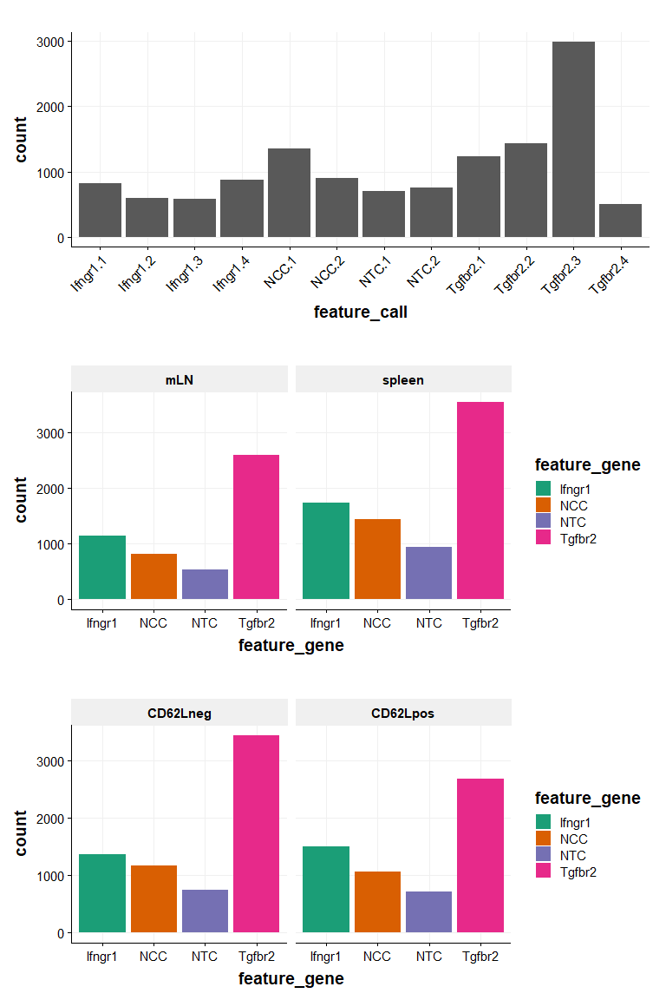<!-- -->

``` r
data@meta.data %>%
  group_by(hash.ID,feature_gene) %>%
  summarise(count = n()) %>%
  ggplot(aes(x = feature_gene, y = count, fill = feature_gene)) +
    geom_bar(stat = "identity") +
    facet_wrap(~hash.ID) +
    scale_fill_brewer(palette = "Dark2")
```

    ## `summarise()` has grouped output by 'hash.ID'. You can override using the
    ## `.groups` argument.

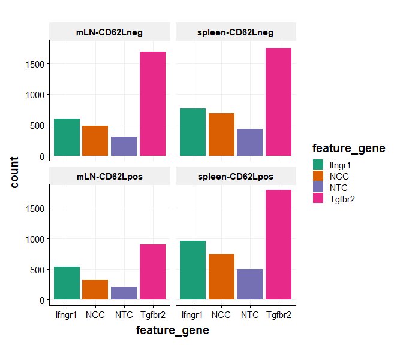<!-- -->

## <u>Psuedobulk by sgRNA</u>

``` r
# perform pseudobulk aggregation
pseudodata <- AggregateExpression(data, assays = "SCT", return.seurat = T, group.by = "feature_call")
```

    ## Centering and scaling data matrix

``` r
pseudodata <- pseudodata[!grepl("^Tra[vdj]|^Trb[vdj]",rownames(pseudodata)),]
pseudodata <- FindVariableFeatures(pseudodata, nfeatures = 2000)
```

    ## Finding variable features for layer counts

``` r
varGenes <- VariableFeatures(pseudodata)

# gather info for metadata
# get UMIs per sgRNA
# get frequency of single sgRNA integrations for individual sgRNA
# get percent.mt
metaData <- data@meta.data %>%
  as_tibble(rownames = "cell_bc") %>%
  group_by(feature_call) %>%
  summarise(freq_cells = n()/nrow(data@meta.data),
            median_sgRNA_umi = median(as.numeric(num_umis)),
            mito_perc = mean(percent.mt))

# convert metadata to df form
ddsColData <- metaData  %>%
  mutate(feature_gene = gsub("\\.\\d+$","",feature_call)) %>%
  mutate(feature_gene = gsub("NTC|NCC","control",feature_gene)) %>%
  as.data.frame()
rownames(ddsColData) <- ddsColData$feature_call

# create DESeq2 object
dds <- DESeqDataSetFromMatrix(pseudodata@assays$SCT$counts,
                              colData = ddsColData,
                              design = ~ feature_gene)
```

    ## converting counts to integer mode

    ## Warning in DESeqDataSet(se, design = design, ignoreRank): some variables in
    ## design formula are characters, converting to factors

``` r
# perform VST normalization
# essentially normalizes to library size while stabilizing variance for lowly expressed genes
ddsNorm <- vst(dds)
```

``` r
p1 <- DESeq2::plotPCA(ddsNorm, intgroup = "feature_gene", ntop=2000) + theme(aspect.ratio = 1) +
  scale_color_brewer(palette = "Dark2") +
  ggtitle("Pseudobulk by Gene Target")
```

    ## using ntop=2000 top features by variance

``` r
p2 <- DESeq2::plotPCA(ddsNorm, intgroup = "mito_perc", ntop=2000) +
  theme(aspect.ratio = 1) +
  scale_color_viridis() +
  ggtitle("Pseudobulk by Mito Percentage")
```

    ## using ntop=2000 top features by variance

``` r
p3 <- DESeq2::plotPCA(ddsNorm, intgroup = "median_sgRNA_umi", ntop=2000) +
  theme(aspect.ratio = 1) +
  scale_color_viridis() +
  ggtitle("Pseudobulk by Median sgRNA UMI")
```

    ## using ntop=2000 top features by variance

``` r
grid.arrange(p1,p2,p3, ncol=3)
```

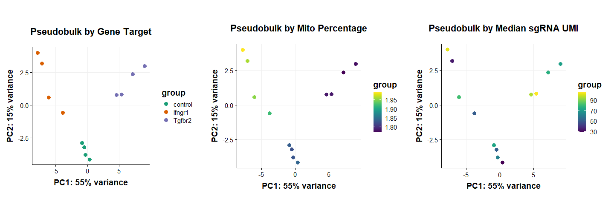<!-- -->

*It’s interesting that Ifngr1 KO cells have higher mitochondrial
percentage. Also interesting that Tgfbr2 KO have higher median sgRNA UMI
(perhaps because they are more proliferative?).* These could be features
of the scRNA-seq dataset that are biologically relevant and “orthogonal”
to DEG analysis alone.

### Correlation Matrices

``` r
# Extract the normalized matrix from the object and compute pairwise correlation values
dds_mat <- assay(ddsNorm)[varGenes,]
dds_cor <- cor(dds_mat)

# Plot heatmap
pheatmap(dds_cor, annotation = ddsColData[, c("mito_perc","median_sgRNA_umi"), drop=F],
         color = viridis(n = 256, alpha = 1, option = "inferno"), clustering_method = "single",
         main = "Pearson Cor of Pseudobulked SCT counts\nTop 2000 Variable Genes")
```

<!-- -->

``` r
pairs(dds_mat, upper.panel = NULL, main = "Correlogram VST Pseudobulked SCT Counts")
```

<!-- -->

Here I will look at the correlation between guides that are pseudobulked
and then Zscored in comparison to the control guides (NCC and NTC)

``` r
# Extract the normalized matrix from the object and compute pairwise correlation values
dds_mat <- assay(ddsNorm)
dds_mat <- dds_mat[varGenes,]

controlMat <- dds_mat[,grepl("NCC|NTC",colnames(dds_mat))]
controlMean <- apply(controlMat, 1, mean) %>% as.matrix()
controlSD <- apply(controlMat, 1, sd) %>% as.matrix()

# calculate Zscore for each gene using mean and SD from control groups
ddsZscore <- data.frame(row.names = rownames(dds_mat))
for(i in 1:ncol(dds_mat)){
  ddsZscore[,i] <- (dds_mat[,i]-controlMean)/controlSD
}
colnames(ddsZscore) <- colnames(dds_mat)
# remove NA and Inf
ddsZscore <- ddsZscore[is.finite(rowSums(ddsZscore)),]

# construct correlation matrix
dds_cor <- cor(ddsZscore, use = "complete.obs") %>%
  as.matrix()

# Plot heatmap
pheatmap(dds_cor, annotation = ddsColData[, c("mito_perc","feature_gene","freq_cells","median_sgRNA_umi"), drop=F],
          color = viridis(n = 256, alpha = 1, option = "inferno"), clustering_method = "single",
         main = "Pearson Cor of Z-scored (centered to control)\nPseudobulked SCT counts of Top 2000 Var Genes")
```

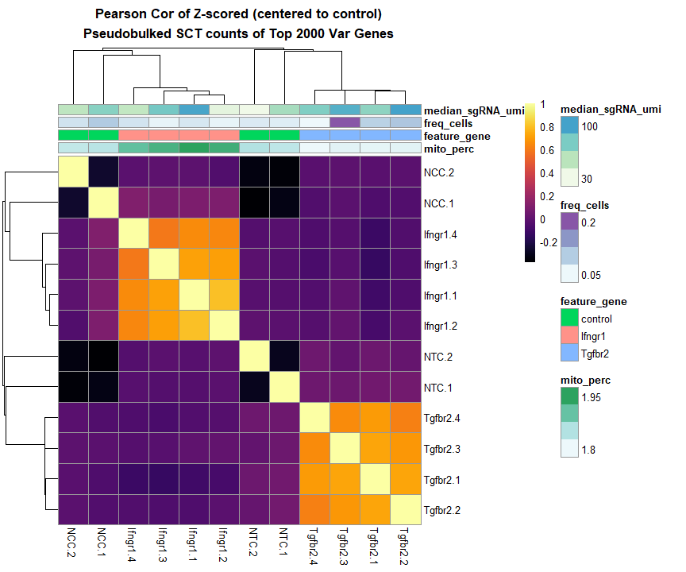<!-- -->

``` r
pairs(ddsZscore, upper.panel = NULL,
      main = "Correlogram VST Pseudobulked SCT Counts Z-scored (centered to control)")
```

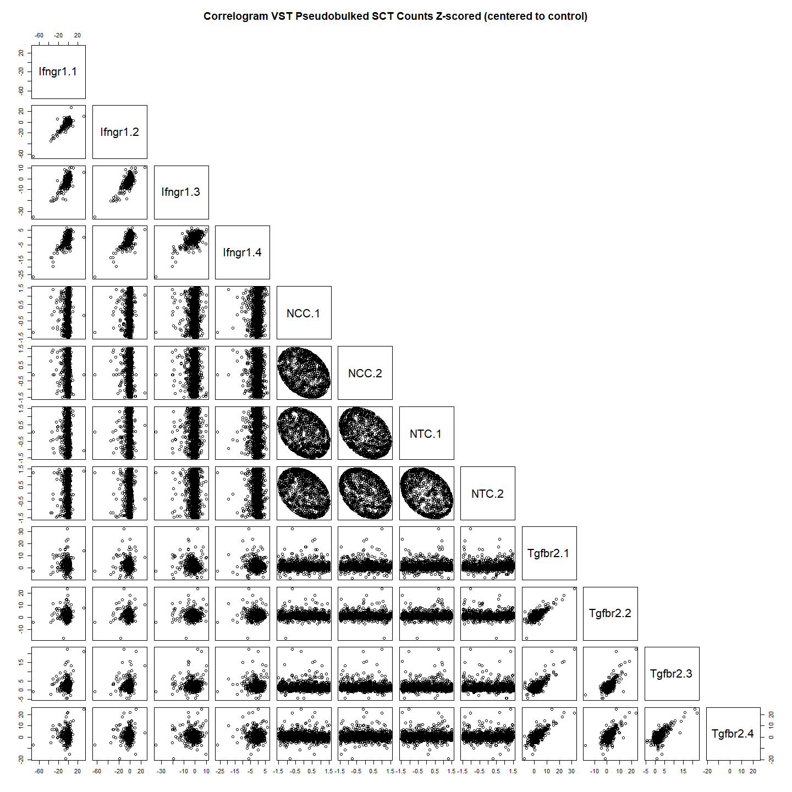<!-- -->

## <u>Psuedobulk by Hash.ID + target gene</u>

``` r
# perform pseudobulk aggregation
pseudodata <- AggregateExpression(data, assays = "SCT", return.seurat = T, group.by = c("hash.ID","feature_gene"))
```

    ## Centering and scaling data matrix

``` r
pseudodata <- pseudodata[!grepl("^Tra[vdj]|^Trb[vdj]",rownames(pseudodata)),]
pseudodata <- FindVariableFeatures(pseudodata, nfeatures = 2000)
```

    ## Finding variable features for layer counts

``` r
varGenes2 <- VariableFeatures(pseudodata)

# gather info for metadata
# get UMIs per sgRNA
# get frequency of single sgRNA integrations for individual sgRNA
# get percent.mt
metaData <- data@meta.data %>%
  as_tibble(rownames = "cell_bc") %>%
  group_by(hash.ID, organ, CD62L_status, feature_gene) %>%
  summarise(freq_cells = n()/nrow(data@meta.data),
            median_sgRNA_umi = median(as.numeric(num_umis)),
            mito_perc = mean(percent.mt),
            mean_nCountRNA = mean(nCount_RNA))
```

    ## `summarise()` has grouped output by 'hash.ID', 'organ', 'CD62L_status'. You can
    ## override using the `.groups` argument.

``` r
# convert metadata to df form
ddsColData <- metaData  %>%
  mutate(sample_name = paste0(hash.ID,"_",feature_gene)) %>%
  as.data.frame() 
rownames(ddsColData) <- ddsColData$sample_name

# create DESeq2 object
dds2 <- DESeqDataSetFromMatrix(pseudodata@assays$SCT$counts,
                              colData = ddsColData,
                              design = ~ organ + CD62L_status + feature_gene)
```

    ## converting counts to integer mode

    ## Warning in DESeqDataSet(se, design = design, ignoreRank): some variables in
    ## design formula are characters, converting to factors

``` r
# perform VST normalization
# essentially normalizes to library size while stabilizing variance for lowly expressed genes
ddsNorm2 <- vst(dds2)
```

``` r
p1 <- DESeq2::plotPCA(ddsNorm2, intgroup = "organ", ntop=2000) + theme(aspect.ratio = 1) +
  ggtitle("Pseudobulk by Organ")
```

    ## using ntop=2000 top features by variance

``` r
p2 <- DESeq2::plotPCA(ddsNorm2, intgroup = "CD62L_status", ntop=2000) + theme(aspect.ratio = 1) +
  ggtitle("Pseudobulk by CD62L status")
```

    ## using ntop=2000 top features by variance

``` r
p3 <- DESeq2::plotPCA(ddsNorm2, intgroup = "feature_gene", ntop=2000) + theme(aspect.ratio = 1) +
  ggtitle("Pseudobulk by sgRNA target")
```

    ## using ntop=2000 top features by variance

``` r
p4 <- DESeq2::plotPCA(ddsNorm2, intgroup = "mito_perc", ntop=2000) +
  theme(aspect.ratio = 1) +
  scale_color_viridis() +
  ggtitle("Pseudobulk by Mean Mito Percentage")
```

    ## using ntop=2000 top features by variance

``` r
p5 <- DESeq2::plotPCA(ddsNorm2, intgroup = "median_sgRNA_umi", ntop=2000) +
  theme(aspect.ratio = 1) +
  scale_color_viridis() +
  ggtitle("Pseudobulk by Median sgRNA UMI")
```

    ## using ntop=2000 top features by variance

``` r
p6 <- DESeq2::plotPCA(ddsNorm2, intgroup = "median_sgRNA_umi", ntop=2000) +
  theme(aspect.ratio = 1) +
  scale_color_viridis() +
  ggtitle("Pseudobulk by Mean nCount RNA")
```

    ## using ntop=2000 top features by variance

``` r
grid.arrange(p1,p2,p3,p4,p5,p6, ncol=3)
```

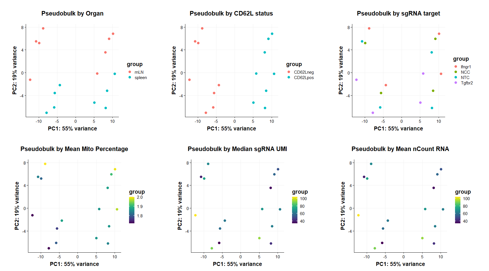<!-- -->

### Correlation Matrices

``` r
# Extract the normalized matrix from the object and compute pairwise correlation values
dds_mat <- assay(ddsNorm2)[varGenes2,]
dds_cor <- cor(dds_mat)

# Plot heatmap
pheatmap(dds_cor, annotation = ddsColData[, c("organ","CD62L_status","feature_gene"), drop=F],
         color = viridis(n = 256, alpha = 1, option = "inferno"), clustering_method = "single",
         main = "Pearson Cor of Top 2000 Var Genes from Pseudobulked SCT counts")
```

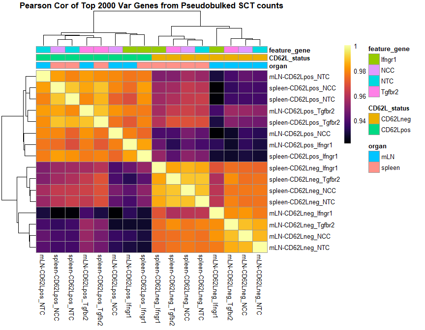<!-- -->

``` r
pairs(dds_mat, upper.panel = NULL, main = "Correlogram VST Pseudobulked SCT Counts")
```

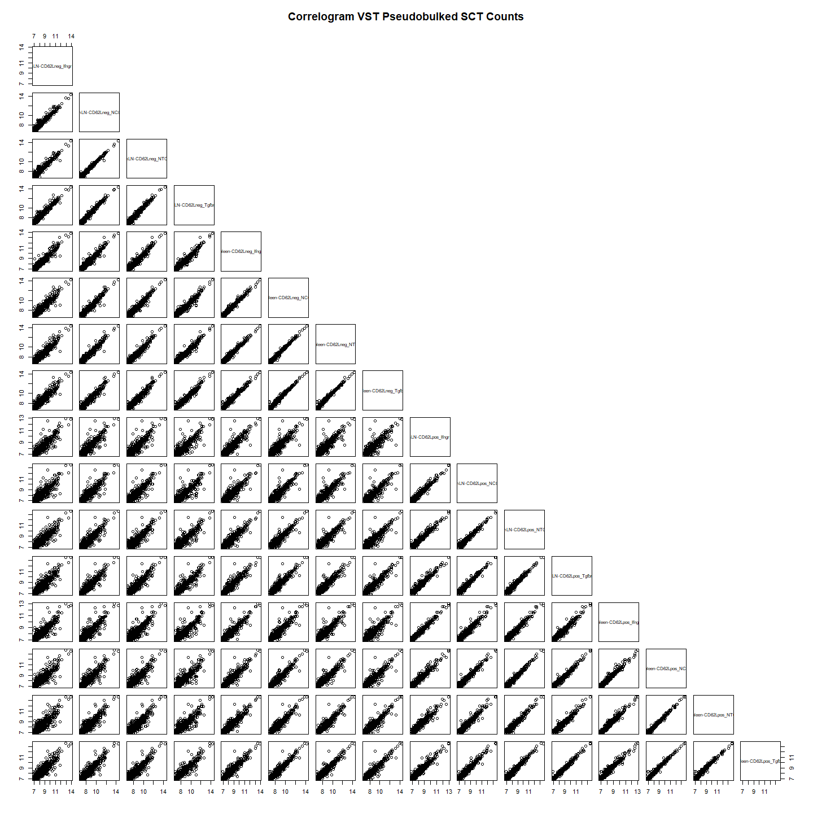<!-- -->

Here I will look at the correlation between guides that are pseudobulked
and then Zscored in comparison to the control guides (NCC and NTC)

``` r
# Extract the normalized matrix from the object and compute pairwise correlation values
dds_mat <- assay(ddsNorm2)
dds_mat <- dds_mat[varGenes2,]

controlMat <- dds_mat[,grepl("NCC|NTC",colnames(dds_mat))]
controlMean <- apply(controlMat, 1, mean) %>% as.matrix()
controlSD <- apply(controlMat, 1, sd) %>% as.matrix()

# calculate Zscore for each gene using mean and SD from control groups
ddsZscore <- data.frame(row.names = rownames(dds_mat))
for(i in 1:ncol(dds_mat)){
  ddsZscore[,i] <- (dds_mat[,i]-controlMean)/controlSD
}
colnames(ddsZscore) <- colnames(dds_mat)

# construct correlation matrix
dds_cor <- cor(ddsZscore, use = "complete.obs") %>%
  as.matrix()

# Plot heatmap
pheatmap(dds_cor, annotation = ddsColData[, c("organ","CD62L_status","feature_gene"), drop=F],
          color = viridis(n = 256, alpha = 1, option = "inferno"), clustering_method = "single",
         main = "Pearson Cor of Z-scored (centered to control)\nPseudobulked SCT counts of Top 2000 Var Genes")
```

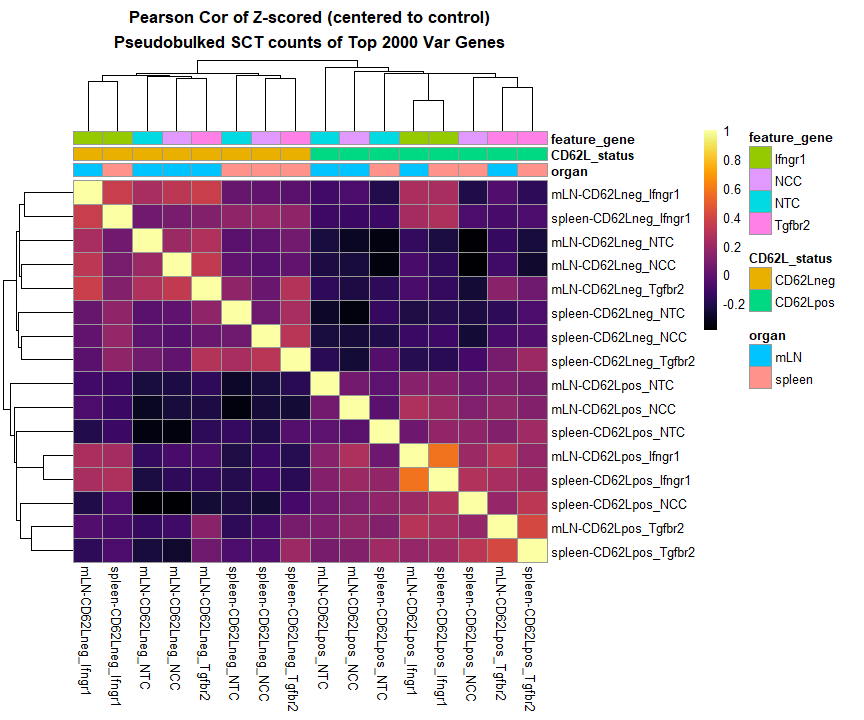<!-- -->

``` r
pairs(ddsZscore, upper.panel = NULL,
      main = "Correlogram VST Pseudobulked SCT Counts Z-scored (centered to control)")
```

<!-- -->

## <u>Psuedobulk by Organ or by CD62L status</u>

``` r
# perform pseudobulk aggregation
pseudodata1 <- AggregateExpression(data, assays = "SCT", return.seurat = T, group.by = c("organ","feature_gene","feature_call"))
```

    ## Centering and scaling data matrix

``` r
pseudodata1 <- pseudodata1[!grepl("^Tra[vdj]|^Trb[vdj]",rownames(pseudodata1)),]

# perform pseudobulk aggregation
pseudodata2 <- AggregateExpression(data, assays = "SCT", return.seurat = T, group.by = c("CD62L_status","feature_gene","feature_call"))
```

    ## Centering and scaling data matrix

``` r
pseudodata2 <- pseudodata2[!grepl("^Tra[vdj]|^Trb[vdj]",rownames(pseudodata2)),]

pdOrgan <- vector(mode = "list")
pdOrgan[["spleen"]] <- subset(pseudodata1, subset = organ == "spleen")
pdOrgan[["mLN"]] <- subset(pseudodata1, subset = organ == "mLN")
pdOrgan[["CD62Lpos"]] <- subset(pseudodata2, subset = CD62L_status == "CD62Lpos")
pdOrgan[["CD62Lneg"]] <- subset(pseudodata2, subset = CD62L_status == "CD62Lneg")

# find variable features for each subset
pdOrgan <- lapply(pdOrgan, function(x) FindVariableFeatures(x, nfeature = 2000))
```

    ## Finding variable features for layer counts

    ## Finding variable features for layer counts
    ## Finding variable features for layer counts
    ## Finding variable features for layer counts

``` r
# create DESeq2 object
ddsOrgan <- lapply(pdOrgan, function(x) DESeqDataSetFromMatrix(x@assays$SCT$counts,
                                                               colData = x@meta.data,
                                                               design = ~ feature_call))
```

    ## converting counts to integer mode

    ## Warning in DESeqDataSet(se, design = design, ignoreRank): some variables in
    ## design formula are characters, converting to factors

    ## converting counts to integer mode

    ## Warning in DESeqDataSet(se, design = design, ignoreRank): some variables in
    ## design formula are characters, converting to factors

    ## converting counts to integer mode

    ## Warning in DESeqDataSet(se, design = design, ignoreRank): some variables in
    ## design formula are characters, converting to factors

    ## converting counts to integer mode

    ## Warning in DESeqDataSet(se, design = design, ignoreRank): some variables in
    ## design formula are characters, converting to factors

``` r
# perform VST normalization
# essentially normalizes to library size while stabilizing variance for lowly expressed genes
ddsOrganNorm <- lapply(ddsOrgan, function(x) vst(x))
```

``` r
p1 <- DESeq2::plotPCA(ddsOrganNorm$spleen, intgroup = "feature_gene", ntop=2000) + theme(aspect.ratio = 1) +
  ggtitle("Pseudobulk Spleen Only")
```

    ## using ntop=2000 top features by variance

``` r
p2 <- DESeq2::plotPCA(ddsOrganNorm$mLN, intgroup = "feature_gene", ntop=2000) + theme(aspect.ratio = 1) +
  ggtitle("Pseudobulk mLN Only")
```

    ## using ntop=2000 top features by variance

``` r
p3 <- DESeq2::plotPCA(ddsOrganNorm$CD62Lpos, intgroup = "feature_gene", ntop=2000) + theme(aspect.ratio = 1) +
  ggtitle("Pseudobulk CD62L+ Only")
```

    ## using ntop=2000 top features by variance

``` r
p4 <- DESeq2::plotPCA(ddsOrganNorm$CD62Lneg, intgroup = "feature_gene", ntop=2000) + theme(aspect.ratio = 1) +
  ggtitle("Pseudobulk CD62L- Only")
```

    ## using ntop=2000 top features by variance

``` r
grid.arrange(p1,p2,p3,p4, ncol=2)
```

<!-- -->

### Correlation Matrices

Here I will look at the correlation between guides that are pseudobulked
and then Zscored in comparison to the control guides (NCC and NTC)

``` r
ZscoreCor <- function(x,y){
  # Extract the normalized matrix from the object and compute pairwise correlation values
  dds_mat <- assay(x)
  dds_mat <- dds_mat[VariableFeatures(y),]
  
  controlMat <- dds_mat[,grepl("NCC|NTC",colnames(dds_mat))]
  controlMean <- apply(controlMat, 1, mean) %>% as.matrix()
  controlSD <- apply(controlMat, 1, sd) %>% as.matrix()
  
  # calculate Zscore for each gene using mean and SD from control groups
  ddsZscore <- data.frame(row.names = rownames(dds_mat))
  for(i in 1:ncol(dds_mat)){
    ddsZscore[,i] <- (dds_mat[,i]-controlMean)/controlSD
  }
  colnames(ddsZscore) <- colnames(dds_mat)
  
  # construct correlation matrix
  dds_cor <- cor(ddsZscore, use = "complete.obs") %>%
    as.matrix()
  
  return(dds_cor)
}

ddsOrganCor <- vector(mode = "list")
for(i in 1:length(ddsOrganNorm)){
  ddsOrganCor[[names(ddsOrganNorm)[i]]] <- ZscoreCor(ddsOrganNorm[[i]],pdOrgan[[i]])
}

# Plot heatmap
pheatmap(ddsOrganCor[[1]],
          color = viridis(n = 256, alpha = 1, option = "inferno"), clustering_method = "single",
         main = "Pearson Cor of Z-scored (centered to control)\nPseudobulked SCT counts of Top 2000 Var Genes\nSpleen")
```

<!-- -->

``` r
pheatmap(ddsOrganCor[[2]],
          color = viridis(n = 256, alpha = 1, option = "inferno"), clustering_method = "single",
         main = "Pearson Cor of Z-scored (centered to control)\nPseudobulked SCT counts of Top 2000 Var Genes\nmLN")
```

<!-- -->

``` r
pheatmap(ddsOrganCor[[3]],
          color = viridis(n = 256, alpha = 1, option = "inferno"), clustering_method = "single",
         main = "Pearson Cor of Z-scored (centered to control)\nPseudobulked SCT counts of Top 2000 Var Genes\nCD62L+")
```

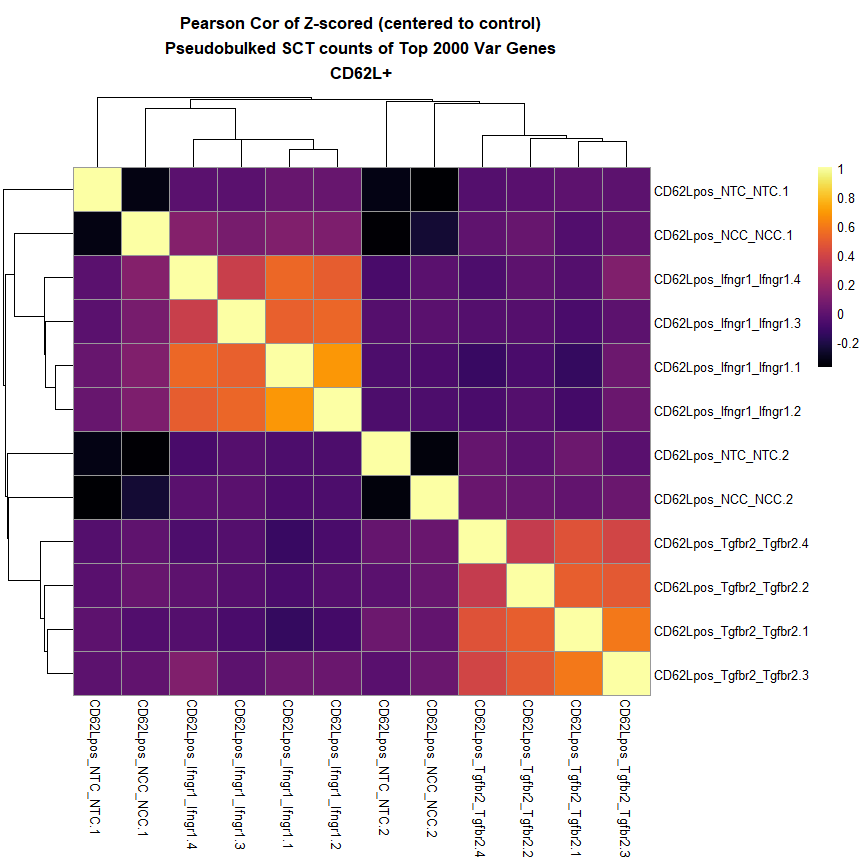<!-- -->

``` r
pheatmap(ddsOrganCor[[1]],
          color = viridis(n = 256, alpha = 1, option = "inferno"), clustering_method = "single",
         main = "Pearson Cor of Z-scored (centered to control)\nPseudobulked SCT counts of Top 2000 Var Genes\nCD62L-")
```

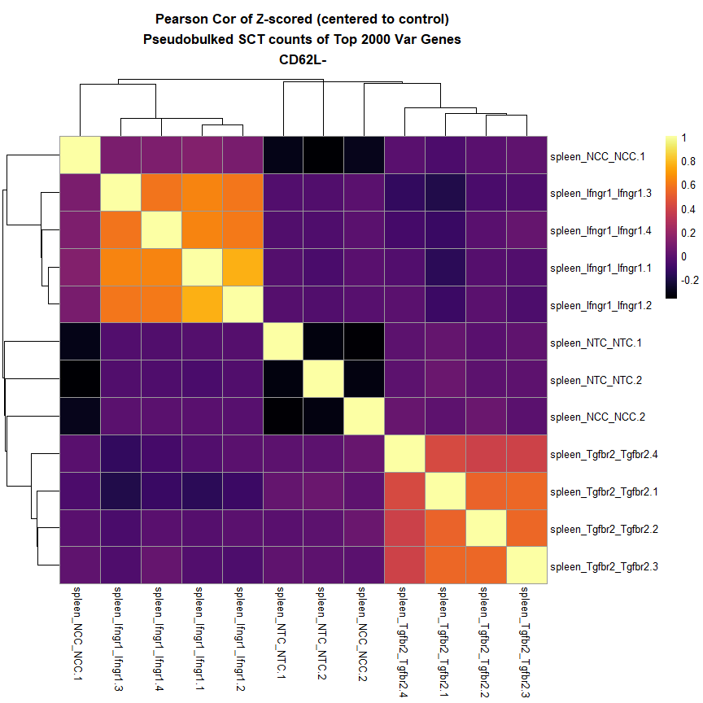<!-- -->

## <u>DEG analysis</u>

Here, I will compare the DEG analysis of bulk sgRNA vs those separated
by resting/activated and tissue

``` r
# perform pseudobulk aggregation
pseudodata <- AggregateExpression(data, assays = "SCT", return.seurat = T, group.by = c("feature_gene","feature_call"))
```

    ## Centering and scaling data matrix

``` r
pseudodata <- pseudodata[!grepl("^Tra[vdj]|^Trb[vdj]",rownames(pseudodata)),]
pseudodata$feature_gene <- gsub("NTC|NCC","control",pseudodata$feature_gene) %>%
  factor(c("control","Ifngr1","Tgfbr2"))

# perform pseudobulk aggregation
pseudodata1 <- AggregateExpression(data, assays = "SCT", return.seurat = T, group.by = c("organ","feature_gene","feature_call"))
```

    ## Centering and scaling data matrix

``` r
pseudodata1 <- pseudodata1[!grepl("^Tra[vdj]|^Trb[vdj]",rownames(pseudodata1)),]
pseudodata1$feature_gene <- gsub("NTC|NCC","control",pseudodata1$feature_gene) %>%
  factor(c("control","Ifngr1","Tgfbr2"))

# perform pseudobulk aggregation
pseudodata2 <- AggregateExpression(data, assays = "SCT", return.seurat = T, group.by = c("CD62L_status","feature_gene","feature_call"))
```

    ## Centering and scaling data matrix

``` r
pseudodata2 <- pseudodata2[!grepl("^Tra[vdj]|^Trb[vdj]",rownames(pseudodata2)),]
pseudodata2$feature_gene <- gsub("NTC|NCC","control",pseudodata2$feature_gene) %>%
  factor(c("control","Ifngr1","Tgfbr2"))

pdOrgan <- vector(mode = "list")
pdOrgan[["all"]] <- pseudodata
pdOrgan[["spleen"]] <- subset(pseudodata1, subset = organ == "spleen")
pdOrgan[["mLN"]] <- subset(pseudodata1, subset = organ == "mLN")
pdOrgan[["CD62Lpos"]] <- subset(pseudodata2, subset = CD62L_status == "CD62Lpos")
pdOrgan[["CD62Lneg"]] <- subset(pseudodata2, subset = CD62L_status == "CD62Lneg")

# find variable features for each subset
pdOrgan <- lapply(pdOrgan, function(x) FindVariableFeatures(x, nfeature = 2000))
```

    ## Finding variable features for layer counts

    ## Finding variable features for layer counts
    ## Finding variable features for layer counts
    ## Finding variable features for layer counts
    ## Finding variable features for layer counts

``` r
# create DESeq2 object
ddsOrgan <- lapply(pdOrgan, function(x) DESeqDataSetFromMatrix(x@assays$SCT$counts,
                                                               colData = x@meta.data,
                                                               design = ~ feature_gene))
```

    ## converting counts to integer mode

    ## converting counts to integer mode
    ## converting counts to integer mode
    ## converting counts to integer mode
    ## converting counts to integer mode

First, we’ll look at Ifngr1 KO DEGs

``` r
# calculate DEGs for all conditions
ifngr1DEG <- function(x){
  dds <- DESeq(x)
  resLFC <- lfcShrink(dds, contrast = c("feature_gene","Ifngr1","control"), type = "ashr")
  resLFC <- resLFC %>%
    as_tibble(rownames = "genes")
}

# create list of tibbles with DEG results
resIfngr1 <- lapply(ddsOrgan, function(x) ifngr1DEG(x))
```

    ## estimating size factors

    ## estimating dispersions

    ## gene-wise dispersion estimates

    ## mean-dispersion relationship

    ## final dispersion estimates

    ## fitting model and testing

    ## using 'ashr' for LFC shrinkage. If used in published research, please cite:
    ##     Stephens, M. (2016) False discovery rates: a new deal. Biostatistics, 18:2.
    ##     https://doi.org/10.1093/biostatistics/kxw041

    ## estimating size factors

    ## estimating dispersions

    ## gene-wise dispersion estimates

    ## mean-dispersion relationship

    ## final dispersion estimates

    ## fitting model and testing

    ## using 'ashr' for LFC shrinkage. If used in published research, please cite:
    ##     Stephens, M. (2016) False discovery rates: a new deal. Biostatistics, 18:2.
    ##     https://doi.org/10.1093/biostatistics/kxw041

    ## estimating size factors

    ## estimating dispersions

    ## gene-wise dispersion estimates

    ## mean-dispersion relationship

    ## final dispersion estimates

    ## fitting model and testing

    ## using 'ashr' for LFC shrinkage. If used in published research, please cite:
    ##     Stephens, M. (2016) False discovery rates: a new deal. Biostatistics, 18:2.
    ##     https://doi.org/10.1093/biostatistics/kxw041

    ## estimating size factors

    ## estimating dispersions

    ## gene-wise dispersion estimates

    ## mean-dispersion relationship

    ## final dispersion estimates

    ## fitting model and testing

    ## using 'ashr' for LFC shrinkage. If used in published research, please cite:
    ##     Stephens, M. (2016) False discovery rates: a new deal. Biostatistics, 18:2.
    ##     https://doi.org/10.1093/biostatistics/kxw041

    ## estimating size factors

    ## estimating dispersions

    ## gene-wise dispersion estimates

    ## mean-dispersion relationship

    ## final dispersion estimates

    ## fitting model and testing

    ## using 'ashr' for LFC shrinkage. If used in published research, please cite:
    ##     Stephens, M. (2016) False discovery rates: a new deal. Biostatistics, 18:2.
    ##     https://doi.org/10.1093/biostatistics/kxw041

``` r
# Combine the tibbles into a single data frame with an identifier
combinedTib <- bind_rows(
  lapply(seq_along(resIfngr1), function(i) {
    resIfngr1[[i]] %>%
      mutate(tibble_id = names(resIfngr1)[i])
  })
)

# Separate the first tibble for comparison
referenceTib <- combinedTib %>% filter(tibble_id == "all")
comparisonTib <- combinedTib %>% filter(tibble_id != "all")

# Merge the reference tibble with the comparison data
comparisonTib1 <- comparisonTib %>%
  left_join(referenceTib, by = "genes", suffix = c("", "_ref")) %>%
  mutate(
    significance = case_when(
      padj_ref < 0.1 & padj < 0.1 ~ "Both",
      padj_ref < 0.1 ~ "Reference",
      padj < 0.1 ~ "Comparison",
      TRUE ~ "None"
    )
  )

# Plotting
ggplot(comparisonTib1, aes(x = log2FoldChange_ref, y = log2FoldChange, color = significance)) +
  geom_point() +
  geom_abline(slope = 1, intercept = 0, linetype = "dashed") +
  facet_wrap(~tibble_id) +
  theme(aspect.ratio = 1) +
  xlim(-4,4) +
  ylim(-4,4) +
  labs(
    title = "Comparison of shrunken Log2FC for Ifngr1 KO",
    x = "log2FC (all cells)",
    y = "log2FC (group)"
  )
```

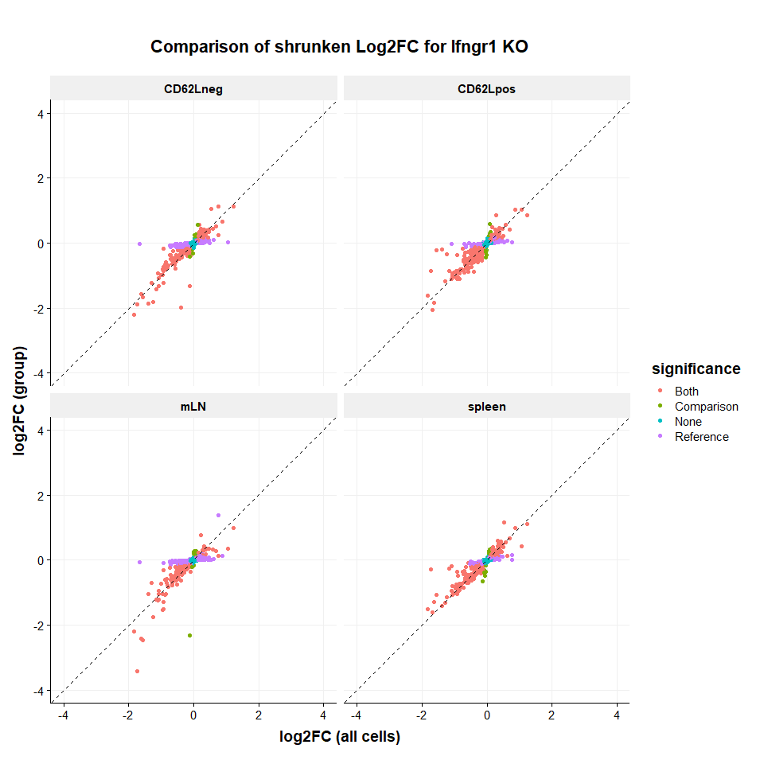<!-- -->

``` r
# Separate the first tibble for comparison
referenceTib <- combinedTib %>% filter(tibble_id == "spleen")
comparisonTib <- combinedTib %>% filter(tibble_id == "mLN")

# Merge the reference tibble with the comparison data
comparisonTib1 <- comparisonTib %>%
  left_join(referenceTib, by = "genes", suffix = c("", "_ref")) %>%
  mutate(
    significance = case_when(
      padj_ref < 0.1 & padj < 0.1 ~ "Both",
      padj_ref < 0.1 ~ "spleen",
      padj < 0.1 ~ "mLN",
      TRUE ~ "None"
    )
  )
write_csv(comparisonTib1,"analysis_outs/pseudobulk_TCRclean_ifngr1_spleen_mLN_DEG.csv")

# Plotting
p1 <- ggplot(comparisonTib1, aes(x = log2FoldChange_ref, y = log2FoldChange, color = significance)) +
  geom_point() +
  geom_abline(slope = 1, intercept = 0, linetype = "dashed") +
  theme(aspect.ratio = 1) +
  xlim(-4,4) +
  ylim(-4,4) +
  labs(
    title = "Ifngr1 KO spleen vs mLN",
    x = "log2FC spleen",
    y = "log2FC mLN"
  )

# Separate the first tibble for comparison
referenceTib <- combinedTib %>% filter(tibble_id == "CD62Lpos")
comparisonTib <- combinedTib %>% filter(tibble_id == "CD62Lneg")

# Merge the reference tibble with the comparison data
comparisonTib1 <- comparisonTib %>%
  left_join(referenceTib, by = "genes", suffix = c("", "_ref")) %>%
  mutate(
    significance = case_when(
      padj_ref < 0.1 & padj < 0.1 ~ "Both",
      padj_ref < 0.1 ~ "CD62Lpos",
      padj < 0.1 ~ "CD62Lneg",
      TRUE ~ "None"
    )
  )
write_csv(comparisonTib1,"analysis_outs/pseudobulk_TCRclean_ifngr1_CD62Lpos_neg_DEG.csv")

# Plotting
p2 <- ggplot(comparisonTib1, aes(x = log2FoldChange_ref, y = log2FoldChange, color = significance)) +
  geom_point() +
  geom_abline(slope = 1, intercept = 0, linetype = "dashed") +
  theme(aspect.ratio = 1) +
  xlim(-4,4) +
  ylim(-4,4) +
  labs(
    title = "Ifngr1 KO CD62L+ vs CD62L-",
    x = "log2FC CD62L+",
    y = "log2FC CD62L-"
  )

grid.arrange(p1,p2, ncol=2)
```

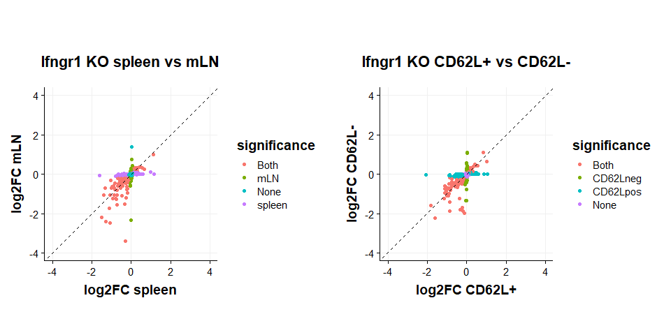<!-- -->

``` r
# calculate DEGs for all conditions
tgfbr2DEG <- function(x){
  dds <- DESeq(x)
  resLFC <- lfcShrink(dds, contrast = c("feature_gene","Tgfbr2","control"), type = "ashr")
  resLFC <- resLFC %>%
    as_tibble(rownames = "genes")
}

# create list of tibbles with DEG results
resTgfbr2 <- lapply(ddsOrgan, function(x) tgfbr2DEG(x))
```

    ## estimating size factors

    ## estimating dispersions

    ## gene-wise dispersion estimates

    ## mean-dispersion relationship

    ## final dispersion estimates

    ## fitting model and testing

    ## using 'ashr' for LFC shrinkage. If used in published research, please cite:
    ##     Stephens, M. (2016) False discovery rates: a new deal. Biostatistics, 18:2.
    ##     https://doi.org/10.1093/biostatistics/kxw041

    ## estimating size factors

    ## estimating dispersions

    ## gene-wise dispersion estimates

    ## mean-dispersion relationship

    ## final dispersion estimates

    ## fitting model and testing

    ## using 'ashr' for LFC shrinkage. If used in published research, please cite:
    ##     Stephens, M. (2016) False discovery rates: a new deal. Biostatistics, 18:2.
    ##     https://doi.org/10.1093/biostatistics/kxw041

    ## estimating size factors

    ## estimating dispersions

    ## gene-wise dispersion estimates

    ## mean-dispersion relationship

    ## final dispersion estimates

    ## fitting model and testing

    ## using 'ashr' for LFC shrinkage. If used in published research, please cite:
    ##     Stephens, M. (2016) False discovery rates: a new deal. Biostatistics, 18:2.
    ##     https://doi.org/10.1093/biostatistics/kxw041

    ## estimating size factors

    ## estimating dispersions

    ## gene-wise dispersion estimates

    ## mean-dispersion relationship

    ## final dispersion estimates

    ## fitting model and testing

    ## using 'ashr' for LFC shrinkage. If used in published research, please cite:
    ##     Stephens, M. (2016) False discovery rates: a new deal. Biostatistics, 18:2.
    ##     https://doi.org/10.1093/biostatistics/kxw041

    ## estimating size factors

    ## estimating dispersions

    ## gene-wise dispersion estimates

    ## mean-dispersion relationship

    ## final dispersion estimates

    ## fitting model and testing

    ## using 'ashr' for LFC shrinkage. If used in published research, please cite:
    ##     Stephens, M. (2016) False discovery rates: a new deal. Biostatistics, 18:2.
    ##     https://doi.org/10.1093/biostatistics/kxw041

``` r
# Combine the tibbles into a single data frame with an identifier
combinedTib <- bind_rows(
  lapply(seq_along(resTgfbr2), function(i) {
    resTgfbr2[[i]] %>%
      mutate(tibble_id = names(resTgfbr2)[i])
  })
)

# Separate the first tibble for comparison
referenceTib <- combinedTib %>% filter(tibble_id == "all")
comparisonTib <- combinedTib %>% filter(tibble_id != "all")

# Merge the reference tibble with the comparison data
comparisonTib2 <- comparisonTib %>%
  left_join(referenceTib, by = "genes", suffix = c("", "_ref")) %>%
  mutate(
    significance = case_when(
      padj_ref < 0.1 & padj < 0.1 ~ "Both",
      padj_ref < 0.1 ~ "Reference",
      padj < 0.1 ~ "Comparison",
      TRUE ~ "None"
    )
  )

# Plotting
ggplot(comparisonTib2, aes(x = log2FoldChange_ref, y = log2FoldChange, color = significance)) +
  geom_point() +
  geom_abline(slope = 1, intercept = 0, linetype = "dashed") +
  facet_wrap(~tibble_id) +
  theme(aspect.ratio = 1) +
  xlim(-3,3) +
  ylim(-3,3) +
  labs(
    title = "Comparison of shrunken Log2FC for Tgfbr2 KO",
    x = "log2FC (all cells)",
    y = "log2FC (group)"
  )
```

    ## Warning: Removed 18 rows containing missing values or values outside the scale range
    ## (`geom_point()`).

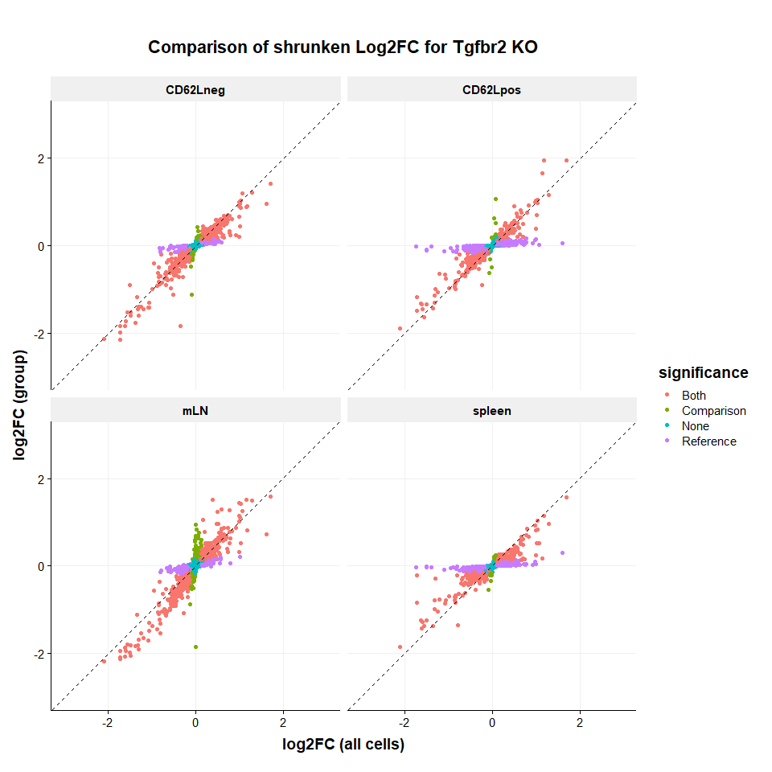<!-- -->

``` r
# Separate the first tibble for comparison
referenceTib <- combinedTib %>% filter(tibble_id == "spleen")
comparisonTib <- combinedTib %>% filter(tibble_id == "mLN")

# Merge the reference tibble with the comparison data
comparisonTib1 <- comparisonTib %>%
  left_join(referenceTib, by = "genes", suffix = c("", "_ref")) %>%
  mutate(
    significance = case_when(
      padj_ref < 0.1 & padj < 0.1 ~ "Both",
      padj_ref < 0.1 ~ "spleen",
      padj < 0.1 ~ "mLN",
      TRUE ~ "None"
    )
  )
write_csv(comparisonTib1,"analysis_outs/pseudobulk_TCRclean_tgfbr2_spleen_mLN_DEG.csv")

# Plotting
p1 <- ggplot(comparisonTib1, aes(x = log2FoldChange_ref, y = log2FoldChange, color = significance)) +
  geom_point() +
  geom_abline(slope = 1, intercept = 0, linetype = "dashed") +
  theme(aspect.ratio = 1) +
  xlim(-3,3) +
  ylim(-3,3) +
  labs(
    title = "Tgfbr2 KO spleen vs mLN",
    x = "log2FC spleen",
    y = "log2FC mLN"
  )

# Separate the first tibble for comparison
referenceTib <- combinedTib %>% filter(tibble_id == "CD62Lpos")
comparisonTib <- combinedTib %>% filter(tibble_id == "CD62Lneg")

# Merge the reference tibble with the comparison data
comparisonTib1 <- comparisonTib %>%
  left_join(referenceTib, by = "genes", suffix = c("", "_ref")) %>%
  mutate(
    significance = case_when(
      padj_ref < 0.1 & padj < 0.1 ~ "Both",
      padj_ref < 0.1 ~ "CD62Lpos",
      padj < 0.1 ~ "CD62Lneg",
      TRUE ~ "None"
    )
  )
write_csv(comparisonTib1,"analysis_outs/pseudobulk_TCRclean_tgfbr2_CD62Lpos_neg_DEG.csv")

# Plotting
p2 <- ggplot(comparisonTib1, aes(x = log2FoldChange_ref, y = log2FoldChange, color = significance)) +
  geom_point() +
  geom_abline(slope = 1, intercept = 0, linetype = "dashed") +
  theme(aspect.ratio = 1) +
  xlim(-3,3) +
  ylim(-3,3) +
  labs(
    title = "Tgfbr2 KO CD62L+ vs CD62L-",
    x = "log2FC CD62L+",
    y = "log2FC CD62L-"
  )

grid.arrange(p1,p2, ncol=2)
```

    ## Warning: Removed 4 rows containing missing values or values outside the scale range
    ## (`geom_point()`).

    ## Warning: Removed 5 rows containing missing values or values outside the scale range
    ## (`geom_point()`).

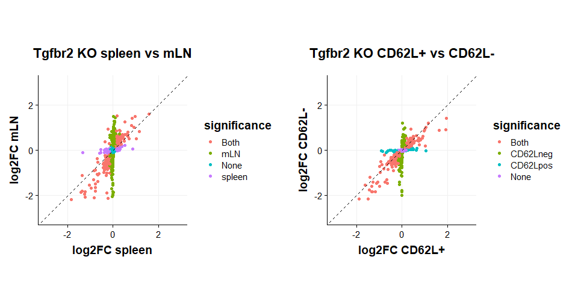<!-- -->
